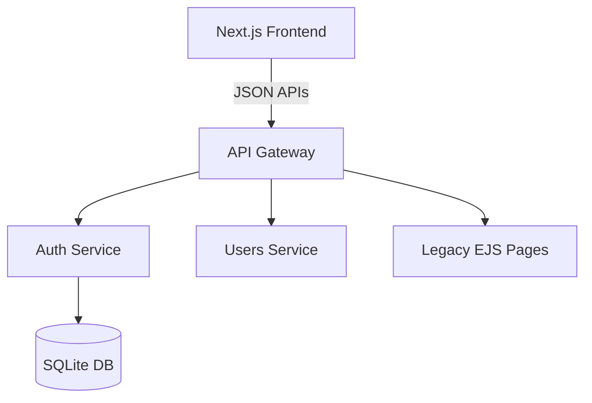
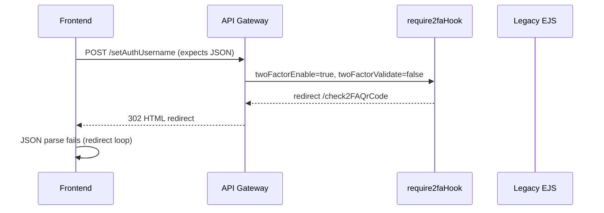
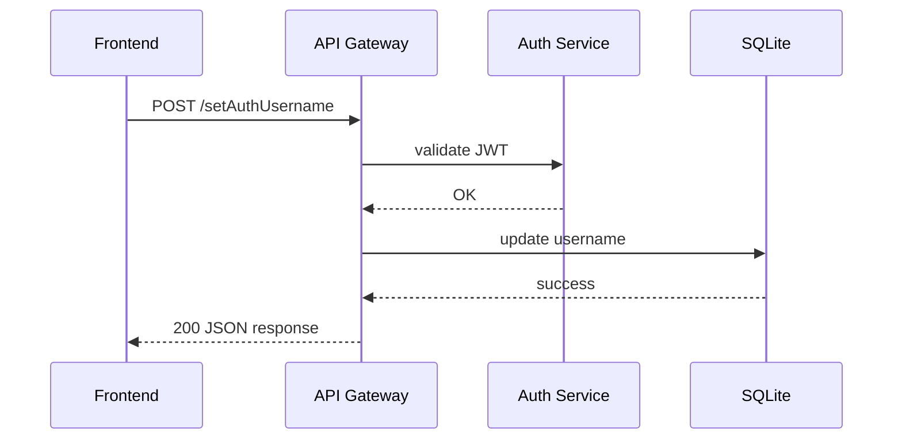
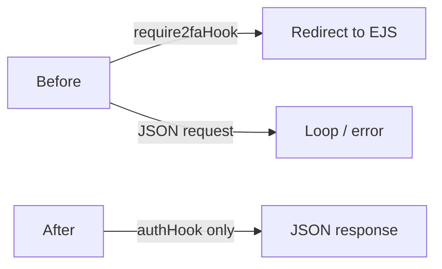

# Bug Report: BR-2FA-REDIRECT-001 - Legacy 2FA Hook Broke JSON Settings Flows

## Header

| Field | Value |
|-------|-------|
| **Bug ID** | BR-2FA-REDIRECT-001 |
| **Title** | Legacy 2FA hook redirected JSON endpoints, breaking settings flows |
| **Severity** | Critical |
| **Priority** | P0 |
| **Status** | ✅ Resolved |
| **Reported** | TBD |
| **Resolved** | TBD |
| **Reporter** | User |
| **Assigned** | Codex |
| **Component** | api-gateway, 2FA, settings |

---

## Executive Summary

**Issue:** Legacy `require2faHook` redirected JSON requests to HTML pages, causing redirect loops.

**User Impact:** Settings actions failed with "An unexpected error occurred," and avatar/email/profile updates stopped working after enabling 2FA.

**Business Impact:** All settings and profile updates were effectively blocked for users with 2FA enabled.

**Root Cause:** A legacy HTML redirect hook ran on all private routes, including JSON APIs, and was still active due to stale container images.

**Resolution:** Removed the legacy hook from the gateway pipeline and rebuilt/recreated containers.

**Resolution Time:** TBD

---

## Symptoms

### User-Visible Issues
- ❌ "An unexpected error occurred. Please try again."
- ❌ Avatar fetch/upload fails
- ❌ Email verification endpoints fail
- ❌ Username/nickname/email changes fail
- ❌ Settings APIs return non-JSON responses or redirect loops

### Error Messages / Logs
Frontend:
- `redirect count exceeded` when calling `/getVerificationStatus`, `/setAuthUsername`, `/api/email/*`
- `Expected JSON but got HTML` (logged in server actions)

Gateway:
- Redirects to `/check2FAQrCode` for JSON endpoints when 2FA enabled and not validated

### Affected Features
- Avatar upload / retrieval
- Email verification and resend
- Profile updates (username, nickname, email, description)
- Settings APIs in general

### Triggers
1. Enable 2FA (sets `twoFactorEnable=true`, `twoFactorValidate=false`)
2. Any subsequent settings or profile action that hits api-gateway private routes

---

## Timeline

| Time | Event | Details |
|------|-------|---------|
| TBD | Legacy hook introduced | `require2faHook` added for EJS flow |
| TBD | Next.js JSON APIs introduced | Settings flows migrated to JSON |
| TBD | Bug observed | Settings broke after enabling 2FA |
| TBD | Investigation | Logs showed redirect loops |
| TBD | Root cause found | Hook still active due to stale images |
| TBD | Fix deployed | Hook removed + containers rebuilt |
| TBD | Verified | JSON endpoints returned 200 |

---

## Root Cause Analysis

### Immediate Cause
`require2faHook` redirected **all private requests** to legacy HTML pages if 2FA was enabled but not validated.

### Underlying Cause
- The hook was designed for EJS pages but remained globally attached to private routes.
- JSON routes didn't differentiate from HTML routes.
- Containers were running old images, so code changes didn't apply.

### Contributing Factors
- No rebuild/recreate after code changes → stale containers.
- JSON requests often used `Accept: */*`, so content-type checks were ineffective.
- 2FA default validation state (`twoFactorValidate=false`) triggered the redirect for every request.

### Why It Wasn't Caught
- No integration tests for **2FA enabled + settings updates**.
- Manual testing mostly used 2FA disabled.
- Deployment didn't enforce container rebuilds.

### Historical Context
Legacy EJS-based flows used redirects and sessions; Next.js JSON flows require strict JSON responses.

---

## Technical Details

### Problematic Code (Before)
From previous deployed image (legacy behavior):
```javascript
// api-gateway/app.js (before)
import { authHook, validatorHook, require2faHook } from './hooks/hooks.js';

app.register(async (privateScope) => {
  privateScope.addHook('preHandler', authHook);
  privateScope.addHook('preHandler', require2faHook);
  privateScope.register(privateRoutes, {});
});
```

`require2faHook` behavior (legacy):
```javascript
// api-gateway/hooks/hooks.js (legacy logic)
if (twoFactorEnable && !twoFactorValidate) {
  return reply.redirect("/check2FAQrCode");
}
```

### Fixed Code (After)
```javascript
// api-gateway/app.js (current)
import { authHook, validatorHook } from './hooks/hooks.js';

app.register(async (privateScope) => {
  privateScope.addHook('preHandler', authHook);
  privateScope.register(privateRoutes, {});
});
```

### Redirect Loop Mechanism
1) Frontend expects JSON from `/getVerificationStatus` or `/setAuthUsername`
2) Gateway intercepts and redirects to `/check2FAQrCode` (HTML page)
3) Frontend follows redirect, still expects JSON → error
4) Retry loops until `redirect count exceeded`

### Request/Response Flow (Broken)
- Request: `POST https://api-gateway:3000/setAuthUsername`
- Response: `302 Location: /check2FAQrCode`
- Frontend: JSON parse fails → "Unexpected error"

---

## Visual Diagrams

### Architecture


### Broken Flow (Redirect Loop)


### Fixed Flow


### Before vs After


---

## Fix

### What Changed
- Removed `require2faHook` from api-gateway private route pipeline.
- Rebuilt and recreated containers to ensure running images matched source.

### Why It Fixes the Issue
- JSON APIs are no longer redirected to legacy HTML pages.
- All settings flows receive the expected JSON response.

### Verification Steps
- `GET /getVerificationStatus` returns JSON 200 with valid JWT.
- Enable 2FA → verify code → settings remain functional.
- Update avatar, nickname, email, description: all succeed.
- No `redirect count exceeded` in frontend logs.

### Deployment Steps Taken
- Rebuild images: `docker compose build api-gateway auth-service sqlite-db frontend`
- Recreate containers: `docker compose up -d --force-recreate api-gateway auth-service sqlite-db frontend`
- Reset 2FA flags for testing.

### Rollback Plan
- Reapply previous image tags for api-gateway (not recommended; reintroduces bug).
- Re-enable hook only if legacy HTML flow is required and JSON APIs are separated.

---

## Impact Analysis

### Affected Features
- Settings updates (avatar, email verification, username, nickname, description)
- Any JSON endpoint routed through api-gateway private scope

### Users Impacted
- All users with 2FA enabled
- Count: Unknown (TBD)

### Duration
- Unknown (TBD)

### Failed Requests
- Unknown (TBD)

---

## Prevention Strategy

### Code-Level
- Remove legacy middleware from modern JSON pipelines.
- Separate HTML and JSON routing scopes.

### Testing
- Add integration tests covering **2FA enabled + settings updates**.
- Add E2E tests verifying JSON response types (no redirects).

### Monitoring
- Alert on repeated 302 responses for `/api/*`.
- Track "redirect count exceeded" errors in frontend logs.

### Process
- Require container rebuild/recreate in deployment checklist.
- Add post-deploy smoke test for settings + 2FA flow.

### Documentation
- Document legacy EJS deprecation and removal timeline.
- Maintain a clear list of JSON vs HTML endpoints.
