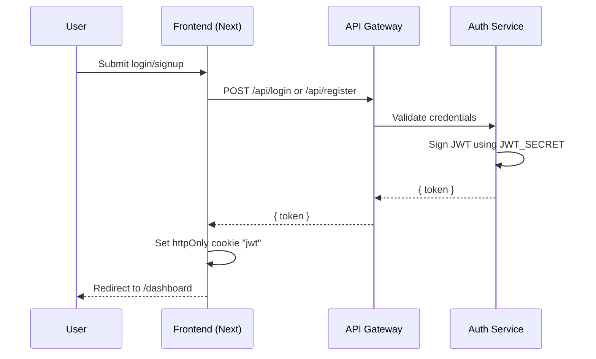
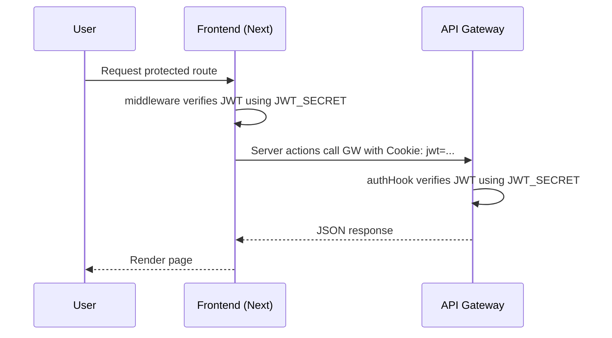
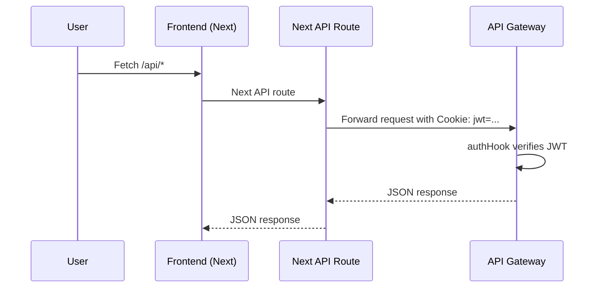
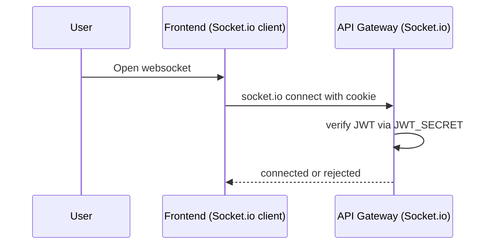

# JWT Environment & Flow Map

## .env Configuration Map

### Source of Truth
- `/.env` (root) is the shared source for `JWT_SECRET`.

### Services that must receive JWT_SECRET
- `auth-service`
- `api-gateway`
- `frontend`

### Docker Compose Wiring
`docker-compose.yml` passes `JWT_SECRET` into the three services using `env_file` + explicit env:
- `env_file: ./.env`
- `environment: JWT_SECRET=${JWT_SECRET}`

### Local (non-docker) dev
- `frontend/.env` must include `JWT_SECRET` if you run Next.js outside Docker.
- `auth-service/.env` and `api-gateway/.env` are still used by their apps when running locally.

### Required Keys
- `JWT_SECRET` must match across all services.
- Avoid `NEXT_PUBLIC_JWT_SECRET` (never expose JWT secret to client).

---

## Flow 1: Login/Signup JWT Creation

---

## Flow 2: Authenticated Request (Server)

---

## Flow 3: Authenticated Request (API proxy)

---

## Flow 4: Socket Auth (Chat/Match)

---

## Verification Checklist

- `JWT_SECRET` exists in root `.env`.
- `docker compose config` shows JWT_SECRET injected into `auth-service`, `api-gateway`, `frontend`.
- Login sets the `jwt` cookie.
- `/dashboard` loads without redirect loops.
- api-gateway logs show no JWT verification errors.

