# ft_transcendence

A multiplayer Pong web application featuring real-time gaming, chat, matchmaking, and user management. Built as a microservices architecture running on Docker.

# Members
  - Fernando Ruan(Product Owner/dev)
  - Jonas Alberto(Tech Lead/dev)
  - José Felipe(Product Manager/dev)
  - Seiji Ueno(dev)
  - Felipe Nasser(dev)

## Database Schema




```mermaid
erDiagram
  AUTH {
    INT id PK "Auto-increment primary key"
    STRING user_id "Internal user identifier used across services"
    STRING username "Unique login username"
    STRING nickname "Unique display nickname"
    STRING email "Unique email address"
    STRING password "Hashed password"
    BOOLEAN twoFactorEnable "Whether 2FA is enabled for the account"
    STRING twoFactorSecret "2FA secret (e.g., TOTP seed); null if not set"
    BOOLEAN twoFactorValidate "Whether 2FA has been validated/confirmed"
    DATETIME created_at "Row creation timestamp"
    DATETIME updated_at "Row last update timestamp (trigger-based)"
  }

  USERS {
    INT id PK "Auto-increment primary key"
    STRING user_id "Unique internal user identifier (stored in DB relations)"
    INT experience_points "User XP points"
    STRING avatar "Avatar path/URL (default image if null)"
    BOOLEAN isOnline "Whether the user is currently online"
    STRING state "Profile status (e.g., ONLINE, OFFLINE, INGAME, etc.)"
    INT rank "Rank/ladder position (or computed rank cache)"
    STRING public_id "Unique public identifier shown on the profile"
    STRING target_id "Target internal user_id (input arrives as public_id -> resolved)"
    STRING description "Public profile description/bio"
    BOOLEAN isEmailConfirmed "Whether email was confirmed/verified"
    INT friends "Cached friend count"
    INT flappy_bird_high_score "Best Flappy Bird score"
    DATETIME created_at "Row creation timestamp"
    DATETIME updated_at "Row last update timestamp (trigger-based)"
  }

  HISTORY {
    INT id PK "Auto-increment primary key"
    INT match_id "Generated match identifier (unique per match)"
    STRING created_at "Stored as a formatted string (not an ISO timestamp)"
    STRING game_type "Game type (e.g., RANKED)"
    STRING duration "Match duration formatted as mm:ss"
  }

  HISTORY_PLAYERS {
    INT id PK "Auto-increment primary key"
    STRING user_id "Player internal user_id (resolved via auth-service at runtime)"
    INT history_id "FK to HISTORY.id"
    INT score "Player score in the match"
    BOOLEAN isWinner "Whether this player won the match"
  }

  MESSAGES {
    INT id PK "Auto-increment primary key"
    STRING content "Message text content"
    STRING sender_id "Sender internal user_id"
    BOOLEAN isSystem "True if the message was generated by the system"
    BOOLEAN isLink "True if the message content contains a link"
    STRING avatar "Sender avatar snapshot/path at send time"
    DATETIME created_at "Message creation timestamp"
  }

  PRIVATEMESSAGES {
    INT id PK "Auto-increment primary key"
    STRING content "Private message text content"
    STRING sender_id "Sender internal user_id"
    STRING receiver_id "Receiver internal user_id (input arrives as public_id -> resolved)"
    BOOLEAN isSystem "True if the message was generated by the system"
    BOOLEAN isBlocked "True if this interaction is blocked for that user"
    STRING avatar "Sender avatar snapshot/path at send time"
    BOOLEAN isLink "True if the message content contains a link"
    DATETIME created_at "Message creation timestamp"
  }

  FRIENDS {
    INT id PK "Auto-increment primary key"
    STRING owner_id "Owner internal user_id (who sent/owns the relation)"
    STRING friend_id "Friend internal user_id (the other side of the relation)"
    BOOLEAN accepted "Whether the friend request was accepted"
    DATETIME created_at "Friend request creation timestamp"
  }

  BLACKLIST {
    INT id PK "Auto-increment primary key"
    STRING owner_id "Owner internal user_id (who is blocking)"
    STRING target_id "Target internal user_id (input arrives as public_id -> resolved)"
    DATETIME created_at "Blacklist entry creation timestamp"
  }

  AUTH ||--|| USERS : "user_id (1:1)"

  HISTORY ||--o{ HISTORY_PLAYERS : "id -> history_id"
  USERS  ||--o{ HISTORY_PLAYERS : "user_id -> user_id"

  USERS ||--o{ MESSAGES : "user_id -> sender_id"

  USERS ||--o{ PRIVATEMESSAGES : "user_id -> sender_id"
  USERS ||--o{ PRIVATEMESSAGES : "user_id -> receiver_id (resolved)"

  USERS ||--o{ FRIENDS : "user_id -> owner_id"
  USERS ||--o{ FRIENDS : "user_id -> friend_id"

  USERS ||--o{ BLACKLIST : "user_id -> owner_id"
  USERS ||--o{ BLACKLIST : "user_id -> target_id (resolved)"

%% Runtime notes:
%% - receiver/target arrive as public_id from the client; backend resolves USERS(public_id)->USERS(user_id).
%% - For match history, services may ask auth-service to obtain user_id before inserting HISTORY_PLAYERS rows.
%% - HISTORY is independent: it represents the match entity; players are attached via HISTORY_PLAYERS.

```

## Table of Contents

- [Features](#features)
- [Architecture](#architecture)
- [Tech Stack](#tech-stack)
- [Getting Started](#getting-started)
- [Services](#services)
- [API Routes](#api-routes)
- [Database Schema](#database-schema)
- [Monitoring](#monitoring)
- [Development](#development)

## Features

### Authentication & Security
- User registration with email validation
- JWT-based authentication with secure httpOnly cookies
- Two-Factor Authentication (2FA) with QR code setup
- Email-based password reset with verification codes
- Captcha integration on login/register
- Password requirements: 8+ chars, uppercase, lowercase, numbers, special chars

### User Management
- Customizable profiles (username, nickname, email, description)
- Avatar upload with automatic image processing
- Online/offline status tracking
- User search and public profiles

### Multiplayer Gaming
- **Pong** - Classic paddle game with physics
- **Flappy Bird** - Obstacle avoidance game
- Real-time game state via WebSocket
- Matchmaking modes:
  - **RANKED**: 1v1 matches with ELO-style ranking
  - **TOURNAMENT**: 4-player double-elimination brackets
- Game statistics and leaderboards

### Social Features
- Friend system (request, accept, reject, block)
- Public chat rooms
- Direct messaging between users
- Real-time notifications via Socket.io
- Message read status tracking

### Dashboard & Analytics
- User statistics (wins/losses/draws, ranking, level, XP)
- Match history with pagination
- Global leaderboard
- Friends list with online status
- Activity feed

## Architecture

```
Browser (HTTPS:443)
    │
    ▼
  nginx ──────────────────────────────────────────────────┐
    │                                                      │
    ├─► / (root only) ──► frontend:3000 (Next.js)         │
    │                                                      │
    ├─► /* (all other) ──► api-gateway:3000 (Fastify)     │
    │        │                                             │
    │        ├──► auth-service:3001                        │
    │        ├──► users-service:3003                       │
    │        └──► chat-service (WebSocket)                 │
    │                                                      │
    ├─► /pong-ws/ ──► game-server:8443 (WebSocket)        │
    │                                                      │
    ├─► /match/ ──► match-service:3010                     │
    │                                                      │
    └─► /grafana/ ──► grafana:3000                         │
```

### Networks

| Network | Purpose |
|---------|---------|
| `transcendence` | Main network connecting nginx, api-gateway, frontend, and core services |
| `game` | Game-related services (game-server, game-pong, game-flappy-bird, match-service) |
| `db_connection` | Database access (sqlite-db, auth-service, users-service, chat-service) |

### Databases

- **SQLite**: Used by api-gateway, auth-service, users-service, chat-service

## Tech Stack

### Frontend
- Next.js 16 with Turbopack
- React 19
- TypeScript 5.7
- Tailwind CSS 3.4
- Socket.io-client

### Backend
- Fastify 5.6
- Node.js 20
- JWT authentication
- Sharp (image processing)
- Nodemailer (emails)
- Speakeasy (2FA)

### Games
- Excalibur game engine (v0.31-0.32)
- Vite build tool
- WebSocket real-time sync

### Infrastructure
- Docker & Docker Compose
- Nginx (reverse proxy, TLS)
- Prometheus, Grafana, Alertmanager (monitoring)

## Getting Started

### For Evaluators 🎓

**See [EVALUATION.md](EVALUATION.md) for complete evaluation instructions.**

Quick start:
```bash
git clone <repository-url>
cd transcendence
make up
# Access at https://localhost
```

### Prerequisites

- Docker and Docker Compose v2
- Make
- Node.js 20+ (for development)
- pnpm (for frontend)

### Quick Start

```bash
# Clone the repository
git clone <repository-url>
cd transcendence

# Start all services (generates TLS certs, builds, runs)
make up

# Access the application
# https://localhost (or your configured domain)
```

### Makefile Commands

```bash
make up        # Start all services
make down      # Stop all services
make build     # Build without starting
make re        # Restart all services
make fclean    # Full clean (removes volumes, images, containers)

# Restart individual services
make api       # api-gateway
make front     # frontend
make auth      # auth-service
make users     # users-service
make chat      # chat-service
make server    # game-server
make pong      # game-pong
make flappy    # game-flappy-bird
make match     # match-service

# View logs
docker compose logs -f <service-name>
```

## Services

| Service | Port | Description |
|---------|------|-------------|
| **nginx** | 80, 443 | Reverse proxy with TLS termination |
| **api-gateway** | 3000 | Central API gateway, routing, session management |
| **frontend** | 3000 | Next.js React dashboard |
| **auth-service** | 3001 | Authentication, 2FA, password reset |
| **users-service** | 3003 | User profiles, avatars, online status |
| **chat-service** | - | Real-time public/private messaging (Socket.io) |
| **sqlite-db** | 3002 | SQLite database service |
| **game-server** | 8443 | WebSocket game state management |
| **game-pong** | - | Pong game client |
| **game-flappy-bird** | - | Flappy Bird game client |
| **match-service** | 3010 | Matchmaking and tournament management |
| **prometheus** | 9090 | Metrics collection |
| **grafana** | 3000 | Metrics visualization |
| **alertmanager** | 9093 | Alert management |

## API Routes

### Public Routes

| Method | Route | Description |
|--------|-------|-------------|
| GET | `/login` | Login page |
| GET | `/register` | Registration page |
| POST | `/checkRegister` | Handle registration |
| POST | `/checkLogin` | Handle login |
| GET | `/forgotPassword` | Password recovery |
| POST | `/checkEmail` | Email verification |
| POST | `/newPassword` | Password reset |

### Private Routes (Requires Authentication)

#### User Management
| Method | Route | Description |
|--------|-------|-------------|
| GET | `/home` | Home dashboard |
| GET | `/logout` | Logout user |
| POST | `/setAuthUsername` | Update username |
| POST | `/setAuthNickname` | Update nickname |
| POST | `/setAuthEmail` | Update email |
| POST | `/setAuthPassword` | Update password |
| GET | `/upload` | Avatar upload |
| GET | `/deleteUserAccount` | Delete account |

#### Two-Factor Authentication
| Method | Route | Description |
|--------|-------|-------------|
| GET | `/get2FAQrCode` | Generate 2FA QR code |
| POST | `/validate2FAQrCode` | Validate 2FA code |
| GET | `/set2FAOnOff` | Toggle 2FA |

#### Social Features
| Method | Route | Description |
|--------|-------|-------------|
| GET | `/seeAllUsers` | User directory |
| GET | `/seeProfile` | View public profile |
| POST | `/friendInvite` | Send friend request |
| POST | `/setAcceptFriend` | Accept friend request |
| POST | `/deleteAFriend` | Remove friend |
| POST | `/blockTheUser` | Block user |
| GET | `/directMessage` | Direct messaging |

#### Gaming
| Method | Route | Description |
|--------|-------|-------------|
| GET | `/match` | Matchmaking page |
| POST | `/match/join` | Join matchmaking queue |
| POST | `/match/leave` | Leave matchmaking queue |
| GET | `/pong` | Pong game |
| GET | `/flappy-bird` | Flappy Bird game |

## Database Schema

### User
```
- id: Int (PK)
- username: String (unique)
- email: String (unique)
- passwordHash: String
- avatar: String
- isOnline: Boolean
- lastSeen: DateTime
- createdAt, updatedAt: DateTime
```

### GameStats
```
- id: Int (PK)
- userId: Int (FK, unique)
- wins, losses, draws: Int
- ranking, level: Int
- xp, winStreak: Int
```

### Match
```
- id: Int (PK)
- player1Id, player2Id, winnerId: Int (FK)
- result: Enum (player1Win, player2Win, draw)
- score: String
- duration: Int
- playedAt: DateTime
```

### Friendship
```
- id: Int (PK)
- userId, friendId: Int (FK)
- status: Enum (pending, accepted, rejected, blocked)
```

### Message & Conversation
```
Message:
- id, conversationId, senderId, receiverId: Int
- content: Text
- isRead: Boolean

Conversation:
- id: Int (PK)
- participants: ConversationParticipant[]
- messages: Message[]
```

### Achievement
```
- id: Int (PK)
- name: String (unique)
- description: String
- category: Enum (wins, matches, streak, ranking, special)
- requirement, xpReward: Int
```

## Monitoring

The project includes a complete monitoring stack:

| Service | Port | Purpose |
|---------|------|---------|
| **Prometheus** | 9090 | Time-series metrics database |
| **Grafana** | /grafana | Visualization dashboards |
| **Alertmanager** | 9093 | Alert routing and management |
| **Node Exporter** | 9100 | Host system metrics |
| **cAdvisor** | 8080 | Docker container metrics |
| **Blackbox Exporter** | 9115 | Endpoint health checks |

Create `monitoring/.grafana-password.txt` (see `monitoring/.grafana-password.txt.example`) with:
```bash
GRAFANA_ADMIN_PASSWORD=your-password-here
```

Access Grafana at `https://localhost/grafana/` after starting the services.

## Development

### Frontend Development

```bash
cd frontend
pnpm install
pnpm dev          # Dev server with Turbopack

```

### API Gateway Development

```bash
cd api-gateway
npm install
npm run build:css    # Build Tailwind CSS
npm run dev:css      # Watch Tailwind CSS
```

### Project Structure

```
ft_trans/
├── api-gateway/         # Fastify API gateway
│   ├── app.js           # Main app setup
│   ├── routes/          # Route definitions
│   ├── controllers/     # Request handlers
│   ├── hooks/           # Auth and validation hooks
│   └── views/           # EJS templates
├── frontend/            # Next.js application
│   ├── app/             # App router pages
│   │   ├── dashboard/   # Dashboard pages
│   │   ├── chat/        # Chat page
│   │   └── ui/          # React components
│   ├── lib/             # Utilities and actions
├── auth-service/        # Authentication service
├── users-service/       # User management service
├── chat-service/        # Real-time chat service
├── game-server/         # WebSocket game server
├── game-pong/           # Pong game client
├── game-flappy-bird/    # Flappy Bird game client
├── match-service/       # Matchmaking service
├── sqlite-db/           # SQLite database service
├── monitoring/          # Prometheus, Grafana, etc.
├── nginx/               # Nginx configuration
├── shared/              # Shared assets
├── docker-compose.yml   # Service orchestration
└── Makefile             # Build commands
```

### Security Features

- JWT tokens with httpOnly, Secure, SameSite=Strict cookies
- Password hashing with bcrypt
- Input validation with regex patterns
- Bad-word filtering
- NSFW content detection for usernames
- Image safety checking for avatars
- DDOS detection in game server
- 2MB file upload limit

## License

This project is part of the 42 school curriculum.
