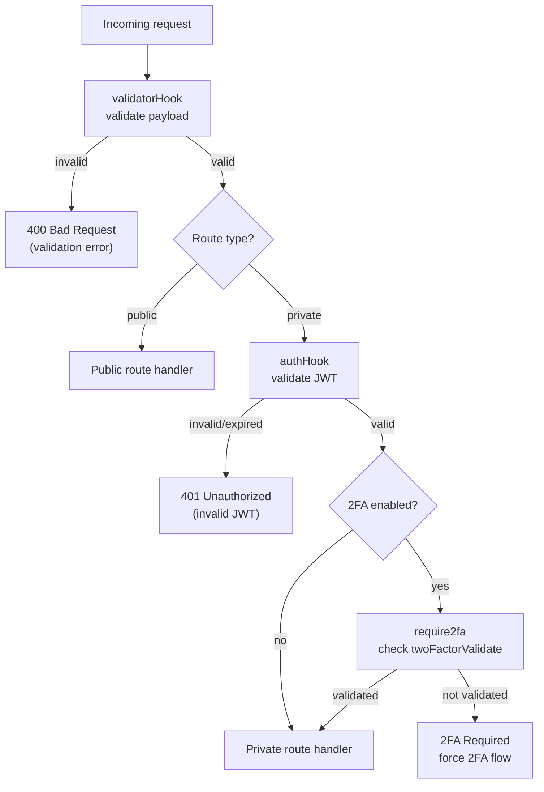

# api-gateway — Public Routes (the Waiter)

> **Image credit:** Pixabay — “People, Couple, Waiter, Table (Vector)”  
> Source page: https://pixabay.com/vectors/people-couple-waiter-table-146963/

---

> **Ludic role:** the `api-gateway` is the **Waiter** at the entrance of the system.  
> Everyone talks to the waiter first. The waiter then forwards the request to the correct “office” (microservice).

---

## The two doors: Public vs Private

The waiter has **two doors**:

- **Public routes** → anyone can knock (login, register, captcha, etc.)
- **Private routes** → only authenticated citizens can enter (profile updates, chat actions, friends, game stats…)

---

## The security chain (executed before any route)

### 1) `validatorHook` (Input Inspector) — always first
Before reaching any handler, every request is checked by `validatorHook`.

**What it enforces**
- required fields exist
- formats are valid (email format, password rules, etc.)
- the payload is “clean enough” to be forwarded

If invalid → the waiter stops the request immediately with **400 Bad Request**.

---

### 2) `authHook` (JWT Guard) — private routes only
If the route is **private**, it goes through `authHook`.

**What it enforces**
- JWT exists (cookie/header)
- JWT is valid (signature)
- JWT is not expired

If invalid → the waiter blocks the request (typically **401 Unauthorized**).

---

### 3) `require2fa` (Second Lock) — private routes only, when 2FA is enabled
If the user has **2FA enabled**, private routes also pass through `require2fa`.

**What it enforces**
- if the user hasn’t validated 2FA in this session yet (`twoFactorValidate == false`),
  it forces the 2FA procedure before letting the request proceed

If not validated → the waiter refuses access until the user completes 2FA.

---

## Visual flow (middleware chain)

## validatorHook behavior (when input is invalid)

If `validatorHook` detects that a request is invalid, the waiter **does not forward anything** to the microservices.

Instead, the waiter immediately **blocks** the request and returns an error response to the client.

### What happens in practice
- The request is stopped **before** reaching the route handler.
- The client receives a response like:
  - `400 Bad Request` (most common)
  - plus a clear error message explaining what is wrong (missing field, invalid email format, weak password, etc.)

### Ludic view
The **Input Inspector** checks the order at the entrance and says:
> “This order is not valid. Fix it before coming in.”

Only after the payload is valid, the waiter is allowed to continue and forward the request.
## authHook behavior (when JWT is missing/invalid)

If a request targets a **private route** and `authHook` detects that the user is **not logged in**
(JWT is missing, invalid, or expired), the api-gateway **blocks the request** and **redirects** the client to:

- `/login`

### What happens in practice
- The private route handler is **never reached**
- The user is immediately sent back to the login page to authenticate again

### Ludic view
The **JWT Guard** stops the citizen at the private door and says:
> “No valid pass, no entry. Go back to the front desk and log in.”

Once the user logs in successfully, the waiter can allow access to private routes again.
# api-gateway — Public Routes (the Waiter)

The `api-gateway` is the **Waiter**: it receives requests from the client and forwards them to the correct microservice.

It also separates **public routes** (anyone can access) from **private routes** (JWT + 2FA required).

---

## Public in-memory stores (short-lived)

These are **temporary notebooks** the waiter keeps at the counter.  
They are **in-memory**, so they disappear if the gateway restarts.

- `captchaStore` — stores `{ code, expiresAt }` by `captchaId`
- `pending2FA` — stores `{ token, email, expiresAt }` by `tempToken`
- `resetCodeStore` — stores `{ code, expiresAt }` by `email`
- `resetTokenStore` — stores `{ email, expiresAt }` by `resetToken`
- `forgotPasswordLimiter` — rate-limit memory for `/forgotPasswordJson`
- `verifyResetLimiter` — rate-limit memory for `/verifyResetCodeJson`
- `resetPasswordLimiter` — rate-limit memory for `/resetPasswordJson`

---

## GETTERS (Public)

## Route: `getIcon`

### 🎭 Story
The waiter hands the browser the restaurant logo.

### ✅ What it does
Serves `favicon.ico`.

### 📥 Inputs
- none

### 📤 Response
- `200` → favicon file

---

## Route: `getCaptchaJson` (JSON for Next.js)

### 🎭 Story
The waiter requests a **fresh CAPTCHA** from the police station (`auth-service`) and attaches a **ticket ID** to it.

### ✅ What it does
1. Calls `auth-service /getCaptcha`
2. Receives `{ code, data }`
3. Generates `captchaId` and stores `{ code, expiresAt }` in `captchaStore`
4. Returns `{ captchaId, image: data }`

### 📥 Inputs
- none

### 📤 Responses
- `200` → `{ captchaId, image }`
- `500` → `{ error: "Failed to generate CAPTCHA" }`

---

## Route: `homePage`

### 🎭 Story
The waiter opens the main hall page.

### ✅ What it does
Renders `homePage` view.

### 📥 Inputs
- none

### 📤 Responses
- `200` → HTML view

---

## Route: `login` (render login page)

### 🎭 Story
The waiter prepares the **login table**:
- clears old session leftovers
- fetches a new CAPTCHA from the police station
- stores the CAPTCHA in session for validation

### ✅ What it does
1. Reads `req.session.success/error`
2. Cleans session fields (`captcha`, `captchaExpires`, `email`, `permission`, etc.)
3. Calls `auth-service /getCaptcha`
4. Stores in session:
   - `captcha` (code)
   - `data` (image)
   - `captchaExpires` (now + 5 minutes)
5. Renders `login` view with `{ success, error, captcha: data }`

### 📥 Inputs
- none

### 📤 Responses
- `200` → login HTML
- redirect `/login` on error (and stores error message in session)

---

## Route: `register` (render register page)

### 🎭 Story
Same as login page, but for the **registration desk**.

### ✅ What it does
Same flow as `login`, but renders `register` view.

### 📥 Inputs
- none

### 📤 Responses
- `200` → register HTML
- redirect `/register` on error

---

## SETTERS (Public, JSON)

## Route: `loginJson` (JSON Login for Next.js)

### 🎭 Story
The waiter checks:
1) “Do you have the right documents?” (email/password/captcha)  
2) “Is this CAPTCHA ticket valid?”  
Then he asks the police inspector (`auth-service`) to validate the credentials.

If the user has **2FA enabled**, the waiter pauses the session and gives a **temporary token** to continue the 2FA step.

### ✅ What it does
1. Validates `{ email, password, captchaId, captchaInput }`
2. Validates captcha using `captchaStore`
3. Calls `auth-service /checkLogin` → expects `{ token }`
4. Calls `auth-service /get2FAEnable`  
   - If `twoFactorEnable`:
     - generates `tempToken`
     - stores `{ token, email, expiresAt }` in `pending2FA`
     - returns `{ requires2FA: true, tempToken }`
5. Else returns `{ token }`

### 📥 Inputs (required)
- `email` *(string)*
- `password` *(string)*
- `captchaId` *(string)*
- `captchaInput` *(string)*

### 📤 Responses
- `200` → `{ token }`
- `200` → `{ requires2FA: true, tempToken }`
- `400` → `{ error: "Missing credentials or captcha" | "CAPTCHA expired" | "Invalid code" }`
- `401/404` → `{ error: "Invalid credentials" | backend message }`
- `500` → `{ error: "Login failed" }`

---

## Route: `registerJson` (JSON Register for Next.js)

### 🎭 Story
The waiter creates a **new citizen ID**, registers the citizen at the police station (`auth-service`),
then creates a **default avatar** and sends it to the profile office (`users-service`).
Finally, the waiter logs the user in and returns the token (or starts 2FA flow).

### ✅ What it does
1. Validates required fields + captcha
2. Validates captcha in `captchaStore`
3. Generates `user_id = UUID`
4. Calls `auth-service /checkRegister`
5. Creates default avatar image locally and saves to `/public/uploads/avatar_<user_id>.png`
6. Calls `users-service /setUserAvatar` with `{ user_id, avatar }`
7. Calls `auth-service /checkLogin` to get `{ token }`
8. If 2FA enabled → returns `{ requires2FA: true, tempToken }`
9. Else returns `{ token }`

### 📥 Inputs (required)
- `username`
- `nickname`
- `email`
- `password`
- `confirmPassword`
- `captchaId`
- `captchaInput`

### 📤 Responses
- `200` → `{ token }`
- `200` → `{ requires2FA: true, tempToken }`
- `400` → `{ error: "Please fill all fields" | "Missing captcha" | "CAPTCHA expired" | "Invalid code" }`
- `409` → `{ error: "User already exists" }`
- `500` → `{ error: "Registration failed" }`

---

## Route: `verify2FALoginJson` (JSON Verify 2FA)

### 🎭 Story
The waiter receives:
- the temporary ticket (`tempToken`)
- the code from the user’s authenticator

He checks the secret with the police station, validates the code, then releases the real token.

### ✅ What it does
1. Validates `{ tempToken, code }`
2. Loads `pending2FA[tempToken]` and checks expiry
3. Calls `auth-service /get2FASecret` using `pending.email`
4. Verifies TOTP using `speakeasy.totp.verify`
5. If ok: deletes `pending2FA[tempToken]`
6. Returns `{ token: pending.token }`

### 📥 Inputs (required)
- `tempToken` *(string)*
- `code` *(string/number)*

### 📤 Responses
- `200` → `{ token }`
- `400` → `{ error: "Missing verification data" | "2FA not configured" | "Invalid verification code" }`
- `401` → `{ error: "Session expired" }`
- `500` → `{ error: "Verification failed" }`

---

## Forgot Password (JSON)

## Route: `forgotPasswordJson` (send reset code)

### 🎭 Story
The waiter checks if the user is spamming requests (rate limit).  
If valid, he confirms the user exists via `auth-service`, generates a reset code and sends it by email.

### ✅ What it does
1. Rate-limit by `req.ip`
2. Validates `{ email }`
3. Calls `auth-service /checkEmail`
4. Calls `auth-service /getCaptcha` to get `{ code }` (used as reset code)
5. Stores `{ code, expiresAt }` in `resetCodeStore[email]` for 10 minutes
6. Sends email with the code using `sendMail`

### 📥 Inputs (required)
- `email` *(string)*

### 📤 Responses
- `200` → `{ success: true }`
- `400` → `{ error: "Missing email" }`
- `404` → `{ error: "User not found" }`
- `429` → `{ error: "Too many requests. Try again later." }`
- `500` → `{ error: "Failed to send reset code" }`

---

## Route: `verifyResetCodeJson` (validate email code)

### 🎭 Story
The waiter checks if the typed code matches the one stored for that email.
If valid, he issues a **reset token** (short-lived) to allow the password change.

### ✅ What it does
1. Rate-limit by `req.ip`
2. Validates `{ email, code }`
3. Checks `resetCodeStore[email]` and expiry
4. If match: deletes reset code and issues `resetToken = UUID`
5. Stores `resetTokenStore[resetToken] = { email, expiresAt }`
6. Returns `{ success: true, token: resetToken }`

### 📥 Inputs (required)
- `email`
- `code`

### 📤 Responses
- `200` → `{ success: true, token }`
- `400` → `{ error: "Missing email or code" }`
- `401` → `{ error: "Invalid or expired code" }`
- `429` → `{ error: "Too many attempts. Try again later." }`
- `500` → `{ error: "Failed to verify code" }`

---

## Route: `resetPasswordJson` (set new password)

### 🎭 Story
The waiter verifies the reset token and then asks the police station to change the password.

### ✅ What it does
1. Rate-limit by `req.ip`
2. Validates `{ email, token, password, confirmPassword }`
3. Confirms `password === confirmPassword`
4. Validates `resetTokenStore[token]` and email match + expiry
5. Calls `auth-service /newPassword` with `{ email, password, confirmPassword }`
6. Deletes `resetTokenStore[token]`
7. Returns success payload

### 📥 Inputs (required)
- `email`
- `token`
- `password`
- `confirmPassword`

### 📤 Responses
- `200` → `{ success: true, data }`
- `400` → `{ error: "Missing fields" | "Passwords do not match" }`
- `401` → `{ error: "Invalid or expired reset token" }`
- `429` → `{ error: "Too many requests. Try again later." }`
- `500` → `{ error: "Failed to reset password" }`

---

## Legacy EJS routes (HTML flow)

## Route: `checkRegister` (EJS register submit)

### 🎭 Story
The waiter takes the registration form, sends it to `auth-service`, and then prepares a default avatar.

### ✅ What it does
- assigns `user_id = UUID`
- validates username/nickname not `system`
- calls `auth-service /checkRegister`
- stores success/error in session
- generates default avatar and calls `users-service /setUserAvatar`
- redirects to `/login` or `/register`

### 📥 Inputs
EJS form body (username, nickname, email, password, confirmPassword, etc.)

### 📤 Responses
- redirect `/login` on success
- redirect `/register` on failure (409 → “Registration failed. Try again”)

---

## Route: `checkLogin` (EJS login submit)

### 🎭 Story
The waiter checks the form, calls the police station for login, and if successful, sets the **JWT cookie**.

### ✅ What it does
- requires captchaInput (validated by validatorHook)
- calls `auth-service /checkLogin`
- sets cookie `jwt` (httpOnly, secure in prod, sameSite strict, maxAge 1h)
- redirects `/home` or back to `/login`

### 📤 Responses
- redirect `/home` on success
- redirect `/login` on failure

---

## Forgot Password (EJS flow)

## Route: `forgotPasswordPage`
Renders the forgot password page with session messages.

## Route: `checkEmail` (EJS)
Validates email exists via `auth-service`, generates code, sends email, redirects to `/validateEmailCode`.

## Route: `validateEmailCode` (EJS)
Renders the code input page (`checkEmailCode` view). Requires `req.session.email`.

## Route: `checkEmailCode` (EJS)
Marks `req.session.permission = true` (captcha validation happens via validatorHook) and redirects `/newPasswordPage`.

## Route: `newPasswordPage` (EJS)
Renders the password reset form. Requires `email` + `permission` in session.

## Route: `newPassword` (EJS)
Calls `auth-service /newPassword`, optionally resets 2FA secret, then redirects `/login`.

---

## Connectivity tests

## Route: `hello`
Calls `auth-service /hello` and returns a combined message.

## Route: `checkDb`
Calls `sqlite-db /hello` and returns a combined message.
# api-gateway — Private Routes (authenticated area)

Private routes are the “behind-the-counter” actions: they **require authentication** and usually operate using `req.user` (decoded from JWT) and/or `req.jwt`.

## Access control pipeline (before any private route runs)

1) **validatorHook (input inspector)**
- If the request payload/params are invalid → it **stops the request immediately** and returns error messages (your “redirecting with error messages”).

2) **authHook (JWT guard)**
- If the user is **not logged in** (missing/invalid/expired JWT) → the gateway **redirects immediately to `/login`**.
- If valid → it injects things like:
  - `req.jwt` (token)
  - `req.user` (decoded user info: `user_id`, `email`, `username`, etc.)

3) **require2fa (2FA enforcement)**
- If 2FA is enabled and not validated yet → forces the 2FA validation flow (so the user can’t access protected features before validating 2FA).

---

## Private in-memory store (short-lived)

### `emailVerificationStore: Map()`
Temporary store for email verification (Next.js JSON flow):
- Key: `email`
- Value: `{ code, expiresAt }`
- Purpose: Validate the code that was emailed to the user.
- Lifetime: In-memory only (lost on gateway restart).

---

# Private Routes (per function)

## Route: `goFlappyBird`
### 🎭 Story
The waiter sends you directly to the Flappy Bird room.

### ✅ What it does
Serves `flappy-bird/index.html`.

### 📥 Inputs
- none

### 📤 Responses
- `200` → HTML file

---

## Route: `goPong`
### 🎭 Story
The waiter sends you to the Pong arena.

### ✅ What it does
Serves `pong/index.html`.

### 📥 Inputs
- none

### 📤 Responses
- `200` → HTML file

---

## Route: `getFlappyHighScore`
### 🎭 Story
The waiter asks the profile office (users-service) for your best Flappy score.

### ✅ What it does
- Reads `{ user_id }` from `req.body`
- Calls `users-service /getFlappyHighScore`
- Returns the service response

### 📥 Inputs
- `user_id` (string)

### 📤 Responses
- `200` → high score payload from users-service (or `0`)
- `500` → `"Error: <message>"`

---

## Route: `setFlappyHighScore`
### 🎭 Story
The waiter updates your Flappy high score in the profile office.

### ✅ What it does
- Validates `score` is a non-negative number
- Calls `users-service /setFlappyHighScore` with `req.body`

### 📥 Inputs
- `user_id` (string)
- `score` (number)

### 📤 Responses
- `200` → users-service response
- `400` → `"Error: Invalid high score"`
- `500` → `"Error: <message>"`

---

## Route: `joinParty`
### 🎭 Story
The waiter uses an invitation token to put you in a match party.

### ✅ What it does
- Reads `token` from `req.params`
- Reads `{ id, game_type }` from `req.body`
- Calls `match-service /join_party/:token`

### 📥 Inputs
- URL param: `token` (string)
- Body: `id` (string), `game_type` (string)

### 📤 Responses
- `200` → party response from match-service
- `500` → `"Error: <message>"`

---

## Route: `leaveParty`
### 🎭 Story
The waiter removes you from the party using your authenticated identity.

### ✅ What it does
- Reads `{ user_id }` from `req.user`
- Calls `match-service /leave_party` with `{ id: user_id }`

### 📥 Inputs
- none (uses `req.user.user_id`)

### 📤 Responses
- `200` → match-service response
- `500` → `"Error: <message>"`

---

## Route: `partyInfo`
### 🎭 Story
The waiter asks match-service what is happening in a specific party.

### ✅ What it does
- Reads `id` from `req.params`
- Calls `match-service GET /party?id=<id>`

### 📥 Inputs
- URL param: `id` (string)

### 📤 Responses
- `200` → party info payload
- `400` → `{ error: "User ID is required" }`
- `500` → `"Error: <message>"`

---

## Route: `helloDb` (private test)
### 🎭 Story
The waiter verifies if auth-service can still reach the database.

### ✅ What it does
Calls `auth-service /helloDb`.

### 📥 Inputs
- none

### 📤 Responses
- `200` → `"API GATEWAY - auth: <result>"`
- fallback text if failing (still returns a string)

---

## Route: `getHomePage` (EJS “home”)
### 🎭 Story
The waiter builds your full “home dashboard” using your JWT identity.

### ✅ What it does
1. Ensures `req.jwt` exists (if missing → redirect `/login`)
2. Loads avatar via `users-service /getUserAvatar`
3. Loads profile data via `users-service /getUserInformation`
4. Loads history via `users-service /getHistory`
5. Renders `home` view with:
   - username, success/error messages, avatar, user data, history

### 📥 Inputs
- none (uses `req.jwt` + `req.user`)

### 📤 Responses
- `200` → `home` HTML view
- redirect `/login` on failure

---

## Route: `logout`
### 🎭 Story
The waiter closes your session, clears cookies, and resets 2FA validation.

### ✅ What it does
- Decodes JWT from cookie
- Marks user offline via `users-service /setIsOnline`
- Destroys session
- Clears cookies: `jwt` and `session`
- Resets `twoFactorValidate=false` via `auth-service /set2FAValidate`
- Redirects `/login`

### 📥 Inputs
- none (uses cookies + `req.user`)

### 📤 Responses
- redirect `/login`

---

## Route: `confirmUserEmail` (EJS start)
### 🎭 Story
The waiter emails a confirmation code to the logged-in user.

### ✅ What it does
- Reads email from verified JWT cookie
- Requests code via `auth-service /getCaptcha` (used as confirmation code)
- Stores it in session (`req.session.captcha`, `captchaExpires`)
- Sends email with that code
- Redirects `/confirmUserEmailCode`

### 📥 Inputs
- none (uses cookie JWT)

### 📤 Responses
- redirect `/confirmUserEmailCode` (success or failure path)

---

## Route: `sendVerificationEmailJson` (Next.js JSON)
### 🎭 Story
Same goal as above, but for JSON clients: send a code and store it in `emailVerificationStore`.

### ✅ What it does
1. Requires `req.user.email` + `req.user.user_id`
2. Checks `users-service /getUserInformation`:
   - If already verified → returns `{ alreadyVerified: true }`
3. Gets code via `auth-service /getCaptcha`
4. Stores `{ code, expiresAt }` in `emailVerificationStore[email]`
5. Sends email
6. Returns `{ success: true }`

### 📥 Inputs
- none (uses `req.user`)

### 📤 Responses
- `200` → `{ success: true }` OR `{ success: true, alreadyVerified: true }`
- `401` → `{ error: "Unauthorized" }`
- `500` → `{ error: "Failed to send verification code" }`

---

## Route: `confirmUserEmailCode` (EJS page)
### 🎭 Story
The waiter shows the page where you type the emailed code.

### ✅ What it does
Renders `confirmUserEmailCode` view with session errors.

### 📥 Inputs
- none

### 📤 Responses
- `200` → HTML view

---

## Route: `validateUserEmailCode` (EJS submit)
### 🎭 Story
If the code is valid (validatorHook enforces that), the waiter marks your email as confirmed.

### ✅ What it does
- Requires `req.body.captchaInput`
- Calls `users-service /validateUserEmail` with `{ email, user_id, stats: true }`
- Redirects `/home` on success
- Redirects `/confirmUserEmailCode` on error

### 📥 Inputs
- `captchaInput` (string) — validated by validatorHook

### 📤 Responses
- redirect `/home` (success)
- redirect `/confirmUserEmailCode` (failure)

---

## Route: `verifyEmailCodeJson` (Next.js JSON submit)
### 🎭 Story
The JSON version: compare user input code to the stored `emailVerificationStore` record.

### ✅ What it does
1. Requires `req.user.email` + `req.user.user_id`
2. If already verified → `{ alreadyVerified: true }`
3. Loads record from `emailVerificationStore[email]`
4. Verifies:
   - not expired
   - code matches (case-insensitive)
5. Calls `users-service /validateUserEmail` with `{ email, user_id, stats: true }`
6. Returns `{ success: true }`

### 📥 Inputs
- Body: `code` (string)

### 📤 Responses
- `200` → `{ success: true }` OR `{ alreadyVerified: true }`
- `400` → `{ error: "Missing code" }`
- `401` → `{ error: "Invalid or expired code" }`
- `500` → `{ error: "Failed to verify code" }`

---

## Route: `getVerificationStatus` (Next.js JSON)
### 🎭 Story
The waiter returns your current “security status”: email verified? 2FA enabled?

### ✅ What it does
- Fetches `isEmailConfirmed` via `users-service /getUserInformation`
- Fetches 2FA enabled via `auth-service /get2FAEnable`
- Returns `{ isEmailVerified, has2FA }`

### 📥 Inputs
- none (uses `req.user`)

### 📤 Responses
- `200` → `{ isEmailVerified, has2FA }`
- `401` → `{ error: "Unauthorized" }`
- `500` → `{ error: "Failed to get verification status" }`

---

## Route: `get2FAQrCode` (EJS + JSON dual mode)
### 🎭 Story
If you have 2FA enabled, the waiter asks auth-service for the QR code so you can set up your authenticator app.

### ✅ What it does
- Reads JWT cookie → decoded email
- Checks `auth-service /get2FAEnable`
- Calls `auth-service /get2FAQrCode`
- If JSON request → returns `{ qrCodeDataURL, image }`
- If HTML request → saves into session then redirects `/check2FAQrCode`

### 📥 Inputs
- none (uses cookie JWT)

### 📤 Responses
- `200` JSON → `{ qrCodeDataURL, image }`
- redirect `/check2FAQrCode` (HTML flow)
- `400` if 2FA not enabled (JSON or redirect with session error)
- `500` on failures

---

## Route: `check2FAQrCode` (EJS page)
### 🎭 Story
The waiter checks if you already validated 2FA before; if not, he shows the QR setup page.

### ✅ What it does
- Calls `auth-service /get2FAValidate`
- If already validated → redirect `/home`
- Else requires session QR data, then renders `check2FAQrCode`

### 📥 Inputs
- none (uses session)

### 📤 Responses
- redirect `/home` (already validated / missing step)
- `200` → HTML view

---

## Route: `validate2FAQrCode` (EJS + JSON)
### 🎭 Story
The waiter verifies the TOTP code against your 2FA secret, then marks 2FA as validated.

### ✅ What it does
- Gets secret via `auth-service /get2FASecret`
- Verifies code using `speakeasy.totp.verify`
- If valid → calls `auth-service /set2FAValidate { signal: true }`
- JSON: returns success payload
- HTML: sets session messages + redirect

### 📥 Inputs
- JSON: `{ code }`
- HTML: form body `{ code }` + session step control (`canValidate`)

### 📤 Responses
- `200` JSON → `{ success: ["2FA verified successfully"] }`
- `400` JSON → missing code / not configured / invalid code
- redirect `/home` or `/check2FAQrCode` (HTML flow)
- `500` on unexpected errors

---

## Route: `upload` (avatar upload, EJS + JSON)
### 🎭 Story
The waiter receives your image, checks if it’s safe and really an image, converts it to a round PNG avatar, stores it, then updates users-service.

### ✅ What it does
1. Receives file stream (`req.file()`)
2. Enforces extension allowlist: `.png .webp .jpg .jpeg`
3. Writes temp file `avatar_<user_id>.tmp`
4. Verifies mime is `image/*`
5. Runs `checkImageSafety` (NSFW / corrupted handling)
6. Converts to `350x350` PNG with circular mask
7. Saves as `/public/uploads/avatar_<user_id>.png`
8. Calls `users-service /setUserAvatar`

### 📥 Inputs
- Multipart file upload

### 📤 Responses
- JSON:
  - `200` → `{ success: true, avatar }`
  - `400/415/422` → validation/safety errors
  - `500` → upload process error
- HTML:
  - redirect `/home` with session success/error

---

## Route: `changeUsername` (EJS page)
Renders `changeUsername` view with session messages.

## Route: `changeNickname` (EJS page)
Renders `changeNickname` view with session messages.

## Route: `changeEmail` (EJS page)
Renders `changeEmail` view with session messages.

---

## Route: `changeDescription` (EJS page)
### ✅ What it does
- Loads current description via `users-service /getUserInformation`
- Renders `changeDescription` with `currentDescription`

### 📤 Responses
- `200` → HTML view (even if data fetch fails, it renders with empty description)

---

## Route: `setUserDescription` (EJS + JSON)
### 🎭 Story
The waiter updates your profile description (max 500 chars).

### ✅ What it does
- Validates presence
- Validates length ≤ 500
- Calls `users-service /setUserDescription { user_id, description }`

### 📥 Inputs
- `description` (string)

### 📤 Responses
- JSON:
  - `200` → success array
  - `400` → missing/too long
  - `500` → server error
- HTML:
  - redirects to `/home` or `/changeDescription`

---

## Route: `changePassword` (EJS page)
Renders `changePassword` view with session messages.

---

## Route: `setAuthPassword` (EJS submit)
### 🎭 Story
The waiter asks auth-service to change your password (must not be the same).

### ✅ What it does
- Validates password + confirm
- Injects `user_id` and `email` from `req.user`
- Calls `auth-service /setAuthPassword`

### 📤 Responses
- redirect `/home` on success
- redirect `/changePassword` on same-password error (400)
- redirect `/home` on generic error

---

## Route: `setAuthEmail` (EJS + JSON)
### 🎭 Story
Email change is heavy: update auth, update email-confirmed flag, handle 2FA state, and re-issue JWT.

### ✅ What it does
1. Validates new email
2. Checks “same as current” → error
3. Checks if user had 2FA enabled (`auth-service /get2FAEnable`)
4. Calls `auth-service /setAuthEmail`
5. Calls `users-service /validateUserEmail { stats:false }` (mark new email as not confirmed)
6. If had 2FA → toggles it via `auth-service /set2FAOnOff`
7. Resets 2FA validation on new email via `auth-service /set2FAValidate false`
8. Creates new token via `auth-service /createNewToken`
9. Sets new `jwt` cookie

### 📥 Inputs
- `email` (string)

### 📤 Responses
- JSON:
  - `200` → `{ success: true }`
  - `400/409/500` → error arrays
- HTML:
  - redirect `/home` or `/changeEmail`

---

## Route: `setAuthNickname` (EJS + JSON)
### 🎭 Story
Updates nickname via auth-service, then re-issues JWT.

### ✅ What it does
- Validates nickname
- Forbids `"system"`
- Calls `auth-service /setAuthNickname`
- Calls `auth-service /createNewToken`
- Sets new `jwt` cookie

### 📥 Inputs
- `nickname` (string)

### 📤 Responses
- JSON: success + token, or errors (403 forbidden nickname, 500)
- HTML: redirects with session messages

---

## Route: `setAuthUsername` (EJS + JSON)
Same pattern as nickname:
- Forbids `"system"`
- Calls `auth-service /setAuthUsername`
- Calls `auth-service /createNewToken`
- Sets `jwt` cookie
- Returns JSON or redirects HTML

---

## Route: `seeAllUsers` (EJS page)
### ✅ What it does
- Calls `users-service /getAllUsersInformation`
- Computes state per user (`getState(user)`)
- Renders `seeAllUsers`

### 📤 Responses
- `200` HTML view
- redirect `/home` on error

---

## Route: `seeProfile` (EJS page)
### ✅ What it does
- Reads `public_id` from query string
- Calls `users-service /getDataByPublicId`
- Calls `users-service /getHistory` for that target user
- Computes target state
- Renders `publicProfile`

### 📤 Responses
- `200` HTML view
- redirect `/home` on error

---

## Route: `chatAllUsers` (EJS page)
### ✅ What it does
- Loads current user info (`users-service /getUserInformation`)
- Renders `chatAllUsers` with own public_id and username

### 📤 Responses
- `200` HTML view
- redirect `/home` on error

---

## Route: `deleteUserAccount` (EJS action)
### ✅ What it does
- Calls `auth-service /deleteUserAccount { user_id }`
- Destroys session, clears cookies
- Redirects `/login`

---

## Route: `blockTheUser` (EJS action)
### ✅ What it does
- Requires `public_id`
- Calls `users-service /blockTheUser { user_id, public_id }`
- Interprets:
  - `201` → blocked
  - else → unblocked
- Redirects `/home`

### 📤 Responses
- redirect `/home`
- Handles SAME_USER via 403

---

## Route: `friendInvite` (EJS action)
### ✅ What it does
- Requires `public_id`
- Calls `users-service /friendInvite { user_id, public_id }`
- `201` → request sent / accepted
- else → already invited
- Redirects `/home`

---

## Route: `handlerFriendsPage` (EJS page)
### ✅ What it does
- Calls `users-service /getAllFriends`
- Calls `users-service /getAllPendencies`
- Renders `handlerFriendsPage`

---

## Route: `setAcceptFriend` (EJS action)
### ✅ What it does
- Requires `public_id`
- Calls `users-service /setAcceptFriend { user_id, public_id, accept:true }`
- Redirects `/handlerFriendsPage`

---

## Route: `deleteAFriend` (EJS action)
### ✅ What it does
- Requires `public_id`
- Calls `users-service /deleteAFriend { user_id, public_id }`
- Redirects `/handlerFriendsPage`

---

## Route: `directMessage` (EJS page)
### ✅ What it does
- Requires query `public_id` (target)
- Renders `chatDirectUsers` with `target_id`

---

## Route: `set2FAOnOff` (EJS + JSON)
### 🎭 Story
Toggles 2FA for the logged-in user.

### ✅ What it does
- Calls `auth-service /set2FAOnOff { user_id }`
- Converts service message into:
  - enabled true/false
  - user-friendly success message
- Returns JSON or redirects `/home`

### 📤 Responses
- `200` JSON → `{ enabled, message, success:[...] }`
- `500` JSON → error array
- HTML redirect `/home`

---

# Next.js JSON API endpoints (private)

## Route: `getProfileData`
### ✅ What it does
- Requires `public_id` in query
- Calls `users-service /getDataByPublicId`
- Computes `state`
- Tries rank (`getRank`), fallback `UNRANKED`

### 📥 Inputs
- Query: `public_id`

### 📤 Responses
- `200` → profile payload
- `400` → `{ error: "public_id is required" }`
- `500` → `{ error: "Error fetching profile data" }`

---

## Route: `apiFriendInvite`
### ✅ What it does
- Requires body `public_id`
- Calls `users-service /friendInvite`
- Returns message based on status

### 📤 Responses
- `200` → `{ success:true, message }`
- `400/403/500` → `{ success:false, message }`

---

## Route: `apiBlockUser`
### ✅ What it does
- Requires `public_id`
- Calls `users-service /blockTheUser`
- `201` => blocked true, else false

### 📤 Responses
- `200` → `{ success:true, blocked, message }`
- `400/403/500` → `{ success:false, message }`

---

## Route: `apiGetHistory`
### ✅ What it does
- Uses `req.query.user_id` OR defaults to `req.user.user_id`
- Uses `limit` (default 10)
- Calls `users-service /getHistory`

### 📤 Responses
- `200` → `{ stats, history }`
- `500` → `{ error: "Error fetching match history" }`

---

## Route: `apiGetAllUsers`
### ✅ What it does
- Calls `users-service /getAllUsersInformation`
- Computes state per user

### 📤 Responses
- `200` → array of users
- `500` → `{ error: "Error fetching users" }`

---

## Route: `apiGetFriends`
### ✅ What it does
- Calls in parallel:
  - `users-service /getAllFriends`
  - `users-service /getAllPendencies`
- Returns `{ friends, pendings }`

### 📤 Responses
- `200` → `{ friends:[], pendings:[] }`
- `500` → `{ error: "Error fetching friends" }`

---

## Route: `apiAcceptFriend`
### ✅ What it does
- Requires `public_id`
- Calls `users-service /setAcceptFriend { accept:true }`

### 📤 Responses
- `200` → `{ success:true, message:"Friend request accepted" }`
- `400/403/500` → `{ success:false, message }`

---

## Route: `apiRemoveFriend`
### ✅ What it does
- Requires `public_id`
- Calls `users-service /deleteAFriend`

### 📤 Responses
- `200` → `{ success:true, message:"Friend removed" }`
- `400/403/500` → `{ success:false, message }`

---

## Route: `apiGetMessages`
### 🎭 Story
Fetches the private inbox list (from chat-service) for the logged user.

### ✅ What it does
- Builds payload: `{ user_id, limit? }`
- Calls `chat-service /getPrivateInbox`
- Normalizes response into an array

### 📥 Inputs
- Query: `limit` (optional number)

### 📤 Responses
- `200` → `{ messages:[], unreadCount:0 }`
- `500` → `{ error: "Error fetching messages" }`
