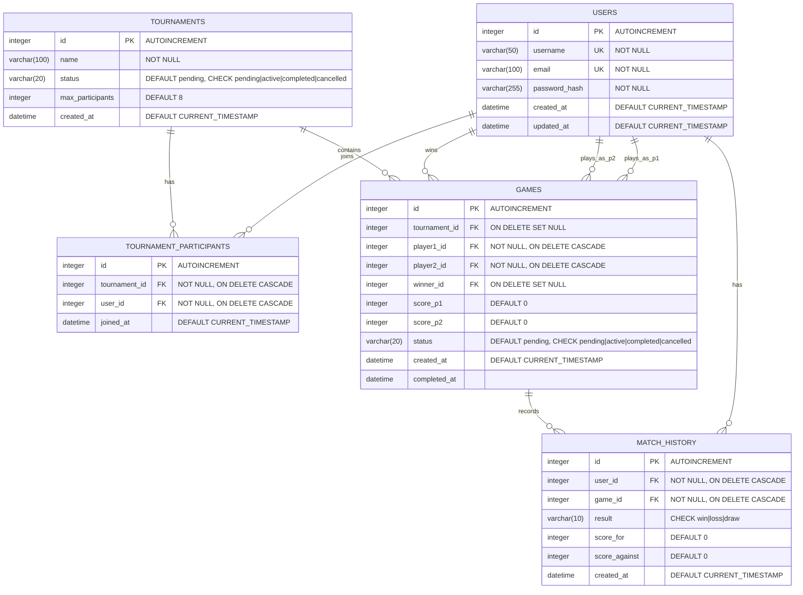

# Database Schema

## Overview
This database manages a tournament system with user participation, games, and match history tracking.

## Entity Relationship Diagram

## Indexes

Performance optimization indexes:
- `idx_users_username` on users(username)
- `idx_users_email` on users(email)
- `idx_tournaments_status` on tournaments(status)
- `idx_tournament_participants_tournament` on tournament_participants(tournament_id)
- `idx_tournament_participants_user` on tournament_participants(user_id)
- `idx_games_tournament` on games(tournament_id)
- `idx_games_players` on games(player1_id, player2_id)
- `idx_games_status` on games(status)
- `idx_match_history_user` on match_history(user_id)
- `idx_match_history_game` on match_history(game_id)

## Constraints

- **UNIQUE**: tournament_participants(tournament_id, user_id) - prevents duplicate entries
- **CHECK**: Status fields enforce valid enum values
- **CASCADE**: Most foreign keys cascade on delete to maintain referential integrity
- **SET NULL**: Tournament and winner references set to NULL on delete to preserve game history