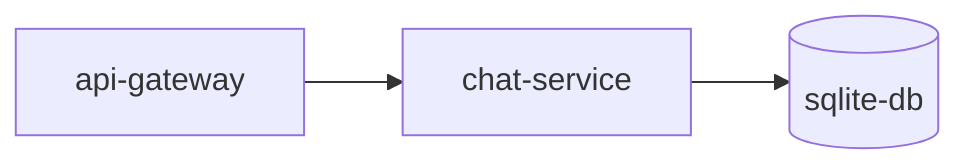

# chat-service


> **Image credit:** Pixabay — “Discussion, Conversation, Communication” (Vector).  
> Source page: https://pixabay.com/vectors/discussion-conversation-9046390/

---

## What this service is

`chat-service` is the **communication hub** of the system.

If we use a ludic metaphor:

- The **api-gateway** is the **messenger** that brings requests from the outside world.
- The **chat-service** is the **switchboard operator** (or radio dispatcher) that routes and archives messages.
- The **sqlite-db** is the **archive room** inside a private intranet where only internal services can write/read safely.


## Route: `storeMessage`

### 🎭 Story (ludic view)
A citizen speaks in the **Public Square**.  
The **dispatcher** (chat-service) receives the message, marks whether it’s a **system announcement** or a normal message, and stores it safely in the **archive room** (sqlite-db).

### ✅ What it does
Stores a **public chat message** in the database.

### 📥 Inputs (required)
Request body:
- `name` *(string)* — sender name shown in public chat
- `msg` *(string)* — message content

Optional:
- `isSystem` *(boolean)* — defaults to `false` if not provided

### 📤 Responses
- `204` → *(No Content)*
- `400` → `"You need to inform the msg and name here"`
- `500` → `"An error happened"`

### 🔒 Internal call (intranet)
- `POST https://sqlite-db:3002/storeMessage` with `req.body`

---

## Route: `getAllMessages`

### 🎭 Story (ludic view)
The dispatcher opens the **Public Square archive** and says:
> “Show me the full public conversation log.”

### ✅ What it does
Fetches **all public chat messages**, using a `username` context.

### 📥 Inputs (required)
Request body:
- `username` *(string)*

### 📤 Responses
- `200` → `response.data` *(messages payload)* or `null`
- `400` → `"You need to inform the username here"`
- `500` → `"An error happened"`

### 🔒 Internal call (intranet)
```js
axios.post("https://sqlite-db:3002/getAllMessages", { username })
```
## Route: `getAllPrivateMessages`

### 🎭 Story (ludic view)
Two citizens want to read their **private chat file**.  
The dispatcher asks:

> “Give me your official ID (`user_id`) and the target’s public badge (`public_id`).  
> I’ll open the right folder in the archive.”

### ✅ What it does
Fetches **all direct messages** between:
- the current user (`user_id`)
- and the target user (identified by `public_id`)

### 📥 Inputs (required)
Request body:
- `user_id` *(string)* — internal ID of the current user
- `public_id` *(string)* — target user public profile ID

### 📤 Responses
- `200` → `response.data` or `[]`
- `400` → `"You need to inform user_id and public_id here"`
- `500` → `"An error happened"`

### 🔒 Internal call (intranet)
- `POST https://sqlite-db:3002/getAllPrivateMessages` with `req.body`

---

## Route: `getPrivateInbox`

### 🎭 Story (ludic view)
The dispatcher checks the citizen’s **Mailbox** and says:

> “Show me all my private conversation threads.”

This is how the user sees their DM list without opening each conversation one by one.

### ✅ What it does
Fetches the user’s **private inbox** (conversation list / last messages / participants — depends on sqlite-db response format).

### 📥 Inputs (required)
Request body:
- `user_id` *(string)* — internal user ID

### 📤 Responses
- `200` → `response.data` or `[]`
- `400` → `"You need to inform user_id here"`
- `500` → `"An error happened"`

### 🔒 Internal call (intranet)
- `POST https://sqlite-db:3002/getPrivateInbox` with `req.body`

---

## Route: `storePrivateMessage`

### 🎭 Story (ludic view)
A citizen writes a private letter and hands it to the dispatcher:

- “This is my official ID (`user_id`).”
- “This is the receiver’s public badge (`public_id`).”
- “This is the letter (`msg`).”

The dispatcher stores the letter in the archive so both sides can read it later.

### ✅ What it does
Stores a **direct message** from the sender (`user_id`) to the target identified by `public_id`.

### 📥 Inputs (required)
Request body:
- `user_id` *(string)* — internal sender ID
- `public_id` *(string)* — receiver public ID (resolved internally downstream)
- `msg` *(string)* — message content

### 📤 Responses
- `201` → `"Success"`
- `400` → `"You need to inform username and public_id here"`
  > (Note: the validation actually checks `user_id`, `msg`, and `public_id`.)
- `500` → `"An error happened"`

### 🔒 Internal call (intranet)
- `POST https://sqlite-db:3002/storePrivateMessage` with `req.body`
