# auth-service


> **Image credit:** Pixabay — “Police, Security, Man” (Vector).  
> Source page: https://pixabay.com/vectors/police-security-man-officer-person-159894/

---

## What this service is

`auth-service` is responsible for **authentication and identity**.

At a high level:

- **Login**: consults the `auth` table to validate credentials (and 2FA flags when enabled).
- **Register**: creates the `auth` row and also creates the corresponding `users` row (the user “profile root”).
- **Identity resolution**: the system often receives **`public_id`** from the client (profile-facing ID). The backend resolves it to **`user_id`** before storing relationships and interactions.

### Where it sits in the architecture

- `api-gateway` → calls → `auth-service`
- `auth-service` → reads/writes → `sqlite-db`


---

## Route: `tryLoginUser`

### Story (ludic view)

Think of the **api-gateway** as a **waiter** that brings a request to the **police inspector** (our **auth-service**).

The inspector’s job is simple:

- **Check if the order is valid** (email + password)
- If it is valid, **allow access** (issue token / session / cookie, depending on your flow)
- If it is invalid, **deny access** (return an error)

This route is exactly the inspector’s “checkpoint”.

---

### What it does (technical view)

`tryLoginUser` validates a login attempt by:

1. Receiving **email** and **password** from the api-gateway.
2. Passing those fields through `validatorHook`:
   - validates **email format**
   - enforces **password rules** (strong password constraints)
3. If validation passes, the auth-service queries the database **inside a private internal network** (intranet):
   - only the **auth-service** can see this network directly
   - the api-gateway never talks to sqlite-db directly

If everything matches (email exists + password is correct), the inspector approves the access.

---

### Who talks to whom

- **api-gateway** → calls → **auth-service** (`tryLoginUser`)
- **auth-service** → queries → **sqlite-db** (private/internal network)


### Success path (the security seal)

If everything is correct, the **police inspector** (auth-service) issues a **security seal** to the **waiter** (api-gateway).

That seal is what the waiter takes back to the client so the browser can finally say:

> “Ok — this user is authenticated. Session is active.”

In practice, this “seal” is usually one of these:
- a **signed token** (e.g., JWT), returned in the response, **or**
- a **secure cookie** set by the server (recommended for browser sessions)

Once the api-gateway returns this seal to the frontend, the browser stores it (cookie/local storage depending on your design) and starts sending it in the next requests, which keeps the session alive.


## Route: `createNewToken`

### Story (ludic view)

After the user is already inside the building (authenticated), they might update sensitive identity data like:

- **username**
- **email**

In our metaphor, that means:

> the user needs a **new security seal**, because the old seal still contains the old identity information.

So the waiter (**api-gateway**) returns to the police inspector (**auth-service**) and asks:

> “Inspector, can you stamp a new seal with the updated info?”

---

### What it does (technical view)

`createNewToken` generates a **new token/seal** for an already-authenticated user when identity-related fields change.

It ensures:

1. The user is **valid** (checks `user_id`).
2. The requested identity info is **consistent** (email + username match what is allowed).
3. A **new seal** is issued containing the updated identity claims.
4. The previous seal can be **replaced** by the client/browser (permission to remove the old one).

---

### Inputs

- **email** *(string)* — the (possibly updated) email
- **username** *(string)* — the (possibly updated) username
- **user_id** *(string)* — internal user identifier (the real identity key)

---

### Output

- **Success:** returns a **new security seal** (new token / cookie) to replace the previous one.
- **Failure:** returns an error indicating what failed:
  - invalid user (`user_id` not found)
  - invalid fields (format rules)
  - conflict (username/email already taken)
  - internal error (DB or token creation problems)

---

### Who talks to whom


## Route: `checkRegister`

### 🎭 Story (ludic view)

A new person is trying to enter the building for the first time.

- The **api-gateway** is the **waiter** bringing the registration form.
- The **auth-service** is the **police inspector** checking every detail.
- If everything is correct, the inspector creates:
  1. the **police file** (the credentials record for login) → **`auth` table**
  2. the **user body/profile** (the public profile root) → **`users` table**

So `checkRegister` is the “**registration checkpoint**” that decides if the person is allowed to become an official user.

---


### What it does (technical view)

`checkRegister` validates a registration attempt by:

1. Checking that **all required fields** exist (nothing missing).
2. Validating field formats (email format, password strength, etc.) — usually through a validation hook/middleware.
3. Verifying there is **no conflict** with existing users:
   - `email` must be unique
   - `username` must be unique
   - `nickname` must be unique
4. Creating the 1:1 records:
   - INSERT into **`auth`** (login credentials / identity)
   - INSERT into **`users`** (profile root / user state)

---

### Inputs (expected)

Typical registration fields (adapt to your real payload):

- **email** *(string)* — must be valid and unique  
- **password** *(string)* — must match strength rules  
- **username** *(string)* — must be unique  
- **nickname** *(string)* — must be unique  

> If you paste the real route code/payload, I’ll rewrite this list to match it 100%.

---

### Output

- **Success:** user is created in `auth` + `users` (1:1 via `user_id`)
- **Failure:** returns an error indicating what failed:
  - missing fields
  - invalid email/password format
  - conflict (email/username/nickname already exists)
  - database/internal error

---

### Who talks to whom


## Route: `getCaptcha`

### 🎭 Story (ludic view)

Before the inspector even checks your documents, you must solve a **human-check stamp**:

- The **auth-service** generates a fresh **captcha challenge**.
- It stores the **captcha code** and its **expiration time** inside the user session.
- Then it returns the captcha to the client so the user can solve it.

So `getCaptcha` is the route that **prints a new challenge ticket** and remembers what the correct answer should be (only on the server side).

---

### What it does (technical view)

`getCaptcha`:

1. Generates a **new captcha** (image or text challenge).
2. Stores in the **session**:
   - the captcha **code/value**
   - the captcha **expiration timestamp**
3. Returns the captcha payload to the client.

> The client receives the challenge, but the **correct answer stays server-side** in the session.

---

### Inputs

- **None** (usually)
  - This route typically only needs the current session context.

---

### Output

- **Success:** returns a captcha challenge (commonly an image / SVG / base64 + metadata)
- **Failure:** returns an internal error if captcha generation or session storage fails

---

### Who talks to whom


## Route: `checkEmail`

### 🎭 Story (ludic view)

The inspector needs to know if an email address is **already confirmed**.

So `checkEmail` is like the inspector checking a record and asking:

> “Has this email been validated by its owner?”

---

### What it does (technical view)

`checkEmail` verifies whether a given **email** is confirmed.

In the database, this is represented by a flag in the user profile:

- `users.isEmailConfirmed` *(BOOLEAN)*

This route typically:

1. Receives an **email**
2. Finds the user/account associated with that email
3. Returns whether the email is confirmed (`true` / `false`)

---

### Inputs

- **email** *(string)* — the email address to be checked

---

### Output

- **Success:** returns the email confirmation status (`true` / `false`)
- **Failure:** returns an error:
  - email not found (no user/account linked to that email)
  - internal database error

---

### Who talks to whom


## Route: `newPassword`

### 🎭 Story (ludic view)

The user wants to change their key to the building.

So the inspector says:

> “Ok — give me the **new key** twice.  
> If both copies match and the key is strong, I can replace the old one.”

That’s exactly what `newPassword` does: it receives the new password and a confirmation, validates them, and updates the stored credentials.

---

### What it does (technical view)

`newPassword` updates a user password by:

1. Receiving:
   - `newPassword`
   - `confirmPassword`
2. Validating:
   - both fields exist
   - both fields match
   - the new password meets the strength rules (usually via the validator hook)
3. Hashing the new password securely
4. Updating the stored password in the database (in `auth.password`)

---

### Inputs

- **newPassword** *(string)* — the new password (must be strong)
- **confirmPassword** *(string)* — must match `newPassword`

> In most implementations this route also requires a way to identify the user (`user_id`, `email`, or a reset token).  
> When you share your real code, I’ll document the exact identifier used.

---

### Output

- **Success:** password updated
- **Failure:** error response indicating what failed:
  - missing fields
  - passwords do not match
  - weak password (validation fails)
  - user not found / invalid reset context
  - internal database error

---

### Who talks to whom


## Route: `get2FAQrCode`

### 🎭 Story (ludic view)

Two-Factor Authentication (2FA) is like the inspector giving the user a **second lock**.

- If the user **does not have a secret yet**, the inspector creates a brand-new secret and prints a **QR Code** so the user can scan it with an authenticator app.
- If the user **already has a secret**, the inspector does **not** print a new QR Code again — instead, the inspector sends a **challenge** based on the existing secret (so the user proves they own that second lock).

So this route behaves like:

> “First time? Here is your QR Code.” 
> “Already configured? Prove you still own it — here’s the challenge.”

---

### What it does (technical view)

`get2FAQrCode` returns the correct 2FA setup/challenge for a user depending on whether they already have a stored secret.

1. **If `twoFactorSecret` is `NULL`:**
   - generate a new secret
   - store it in `auth.twoFactorSecret`
   - return a **QR Code** (for setup)

2. **If `twoFactorSecret` already exists:**
   - do **not** generate a new secret
   - do **not** return the QR Code again
   - return a **challenge** derived from the existing secret (so the user can validate/confirm 2FA)

---

### Inputs

- A user identifier (commonly **`user_id`**) to locate the account in `auth`

> If in your implementation you use `email` or a token, tell me and I’ll adjust.

---

### Output

Two possible “success shapes”:

- **Setup mode (no existing secret):**
  - returns a **QR Code** (image/svg/base64) + setup metadata

- **Challenge mode (secret already exists):**
  - returns a **2FA challenge** based on the existing secret (no QR Code)

Failure cases:
- user not found
- internal DB error
- secret generation error

---

### Who talks to whom


```mermaid
sequenceDiagram
  autonumber
  participant W as api-gateway (waiter)
  participant P as auth-service (police inspector)
  participant DB as sqlite-db (private intranet)

  W->>P: get2FAQrCode(user_id)
  P->>DB: SELECT twoFactorSecret FROM auth WHERE user_id = ?
  DB-->>P: secret OR null

  alt secret is NULL (first time setup)
    P->>P: generate new secret + QR Code
    P->>DB: UPDATE auth SET twoFactorSecret = <secret> WHERE user_id = ?
    P-->>W: QR Code payload (setup)
  else secret exists (already configured)
    P->>P: generate challenge based on existing secret
    P-->>W: challenge payload (no QR Code)
  end
```

## Route: `get2FAEnable`

### 🎭 Story (ludic view)

The inspector checks a specific user record and answers a simple question:

> “Is the second lock (2FA) turned on for this email?”

Because **email is unique** in the system, it works like a perfect ID card for this lookup.

---

### What it does (technical view)

`get2FAEnable` returns whether **2FA is enabled** for the target user.

In the database, this is stored in:

- `auth.twoFactorEnable` *(BOOLEAN)*

This route typically:

1. Receives the target **email**
2. Queries the `auth` table by that email
3. Returns `twoFactorEnable` (`true` / `false`)

---

### Inputs

- **email** *(string)* — target user email (**unique** in the system)

---

### Output

- **Success:** returns whether 2FA is enabled (`true` / `false`)
- **Failure:** error response indicating what failed:
  - email not found (no account for that email)
  - internal database error

---

### Who talks to whom


## Route: `get2FASecret`

### 🎭 Story (ludic view)

The inspector looks at the user’s file and checks:

> “Do you already have a second-lock secret registered for this email?”

- If **yes**, the inspector returns the secret so the system can generate a **2FA challenge**.
- If **no**, the inspector returns **`null`**, meaning:

> “No secret yet — we must generate a QR Code to set 2FA up.”

---

### What it does (technical view)

`get2FASecret` retrieves the stored 2FA secret for a given email.

In the database, this is stored in:

- `auth.twoFactorSecret` *(TEXT | NULL)*

This route typically:

1. Receives the target **email** (unique)
2. Queries `auth.twoFactorSecret`
3. Returns:
   - the secret (string) if it exists
   - `null` if it does not exist

---

### Inputs

- **email** *(string)* — target user email (**unique** in the system)

---

### Output

- **Success:** returns:
  - `twoFactorSecret` *(string)*, **or**
  - `null` (meaning “no secret, generate QR Code”)
- **Failure:** returns an error:
  - email not found
  - internal database error

---

### Who talks to whom


## Route: `get2FAValidate`

### 🎭 Story (ludic view)

2FA validation is like the inspector asking the user to prove they own the **second lock**.

Once the user has already proven it (validated), the inspector can say:

> “Ok, you’re validated for this session cycle.  
> You don’t need to prove it again every minute — only when you log out and log in again.”

So `get2FAValidate` answers the question:

> “Has this user already validated the 2FA challenge?”

---

### What it does (technical view)

`get2FAValidate` returns whether the user has already validated their 2FA challenge.

In the database, this is stored in:

- `auth.twoFactorValidate` *(BOOLEAN)*

This route typically:

1. Receives a unique identifier (commonly **email** in your service design)
2. Queries the `auth` table
3. Returns the boolean `twoFactorValidate`

---

### Inputs

- **email** *(string)* — target user email (**unique** in the system)

> If your implementation uses `user_id` instead, tell me and I’ll adjust.

---

### Output

- **Success:** returns `twoFactorValidate`:
  - `true` → user already validated 2FA (no need to re-challenge during the same login cycle)
  - `false` → user still needs to validate
- **Failure:** error response indicating what failed:
  - email not found
  - internal database error

---

### Who talks to whom


## Route: `set2FAValidate`

### 🎭 Story (ludic view)
After the user proves the **second lock** (2FA challenge), the inspector needs to **record the result** in the police file:
- ✅ validated (`true`)
- ❌ not validated (`false`)

This route is the official “**stamp**” that marks whether the user has already passed the 2FA checkpoint.

---

### What it does (technical view)
- Validates input payload (`email` + `signal`)
- Forwards the update to the internal database service:
  - `POST https://sqlite-db:3002/set2FAValidate`
- Returns a simple success message.

---

### Inputs (required)
Request body must include:
- `email` *(string)* — target user email
- `signal` *(boolean)* — the validation flag (true/false)

> Note: In your code, `signal === undefined` is rejected, so `false` is valid.

---

### Responses
- `200` → `"Success"`
- `400` → `"You need to inform an email and signal here"`
- `500` → `"Internal Server Error"`

---

### Internal call (intranet)
- `axios.post("https://sqlite-db:3002/set2FAValidate", req.body)`
## Route: `set2FASecret`

### 🎭 Story (ludic view)
The secret is the **core material** used to forge the 2FA lock.

This route either:
- stores a **new secret** (setup), or
- clears it (`null`) if you want to reset the 2FA setup.

---

### What it does (technical view)
- Requires `email`
- If `secret` is missing, it sets `secret = null`
- Sends `{ email, secret }` to sqlite-db:
  - `POST https://sqlite-db:3002/set2FASecret`

---

### Inputs
Required:
- `email` *(string)*

Optional:
- `secret` *(string | null)* — if undefined, it becomes `null`

---

### Responses
- `200` → `"Success"`
- `400` → `"You need to inform an email"`
- `500` → `"Internal Server Error"`

---

### Internal call (intranet)
```js
axios.post("https://sqlite-db:3002/set2FASecret", {
  email: req.body.email,
  secret: req.body.secret ?? null,
});
```

## Route: `getAuthData`

### 🎭 Story (ludic view)
The inspector opens the police file and retrieves the **account identity data** of a specific user.

---

### What it does (technical view)
- Requires `user_id`
- Requests auth data from sqlite-db:
  - `POST https://sqlite-db:3002/getAuthData`
- Returns the fetched data.

---

### Inputs (required)
- `user_id` *(string)* — internal user identifier

---

### Responses
- `200` → returns the data from sqlite-db (see note below)
- `400` → `"You need to inform your user_id"`
- `500` → `"An error happened"`

---

### Internal call (intranet)
- `axios.post("https://sqlite-db:3002/getAuthData", req.body)`

## Route: `setAuthUsername`

### 🎭 Story (ludic view)
The user wants to change the name printed in the **police file** (login identity).  
The inspector checks the request and updates the record.

---

### What it does (technical view)
- Requires `user_id` + `username`
- Updates username in sqlite-db:
  - `POST https://sqlite-db:3002/setAuthUsername`

---

### Inputs (required)
- `user_id` *(string)*
- `username` *(string)*

---

### Responses
- `200` → `"Username changed successfully"`
- `400` → `"You need to inform your user_id and username"`
- `500` → `"An error happened"`

## Route: `setAuthNickname`

### 🎭 Story (ludic view)
The user wants to change the **nickname** stored in the police file.  
Inspector verifies the request and applies the update.

---

### What it does (technical view)
- Requires `user_id` + `nickname`
- Updates nickname in sqlite-db:
  - `POST https://sqlite-db:3002/setAuthNickname`

---

### Inputs (required)
- `user_id` *(string)*
- `nickname` *(string)*

---

### Responses
- `200` → `"Nickname changed successfully"`
- `400` → `"You need to inform your user_id and nickname"`
- `500` → `"An error happened"`

## Route: `setAuthEmail`

### 🎭 Story (ludic view)
Email is a critical identity field.  
When the user wants to change it, the inspector must ensure it **does not collide** with another citizen’s email.

---

### What it does (technical view)
- Requires `user_id` + `email`
- Updates email in sqlite-db:
  - `POST https://sqlite-db:3002/setAuthEmail`
- If sqlite-db reports conflict, return `409`.

---

### Inputs (required)
- `user_id` *(string)*
- `email` *(string)*

---

### Responses
- `200` → `"Email changed successfully"`
- `400` → `"You need to inform your user_id and e-mail"`
- `409` → `"Email already in use"`
- `500` → `"An error happened"`

---

### Internal call (intranet)
- `axios.post("https://sqlite-db:3002/setAuthEmail", req.body)`

## Route: `setAuthPassword`

### 🎭 Story (ludic view)
Changing a password is like issuing a **new key** for the building.  
The inspector accepts the request and asks the database to safely replace the old key.

---

### What it does (technical view)
- Requires `user_id` + `password` (new password)
- Sends update to sqlite-db:
  - `POST https://sqlite-db:3002/setAuthPassword`
- If sqlite-db rejects because the new password equals the old one, it returns `400`.

---

### Inputs (required)
- `user_id` *(string)*
- `password` *(string)* — new password

---

### Responses
- `200` → `"Password changed successfully"`
- `400` → `"You need to inform your user_id and the new password"` *(missing fields)*
- `400` → `"You cannot change to the same password"` *(sqlite-db rule)*
- `500` → `"An error happened"`
## Route: `deleteUserAccount`

### 🎭 Story (ludic view)
This is the “erase the identity file” operation:  
the inspector receives the internal ID and asks the database to remove the user account.

---

### What it does (technical view)
- Requires `user_id`
- Requests deletion in sqlite-db:
  - `POST https://sqlite-db:3002/deleteUserAccount`
- Returns `204 No Content` on success.

---

### Inputs (required)
- `user_id` *(string)*

---

### Responses
- `204` → *(empty body)*
- `400` → `"You need to inform your user_id here"`
- `500` → `"An error happened"`
## Route: `set2FAOnOff`

### 🎭 Story (ludic view)
This is the switch that turns the **second lock** ON or OFF.

The inspector checks the user, flips the switch in the records, and reports the new state:
- `"2FA_ENABLED"` or `"2FA_DISABLED"`

---

### What it does (technical view)
- Requires `user_id`
- Calls sqlite-db:
  - `POST https://sqlite-db:3002/set2FAOnOff`
- Reads `response.data.message` and returns one of:
  - `{ "message": "2FA_ENABLED" }`
  - `{ "message": "2FA_DISABLED" }`

---

### Inputs (required)
- `user_id` *(string)*

---

### Responses
- `200` → `{ "message": "2FA_ENABLED" }` **or** `{ "message": "2FA_DISABLED" }`
- `400` → `"You need to inform user_id here"`
- `500` → `"An error happened"`
