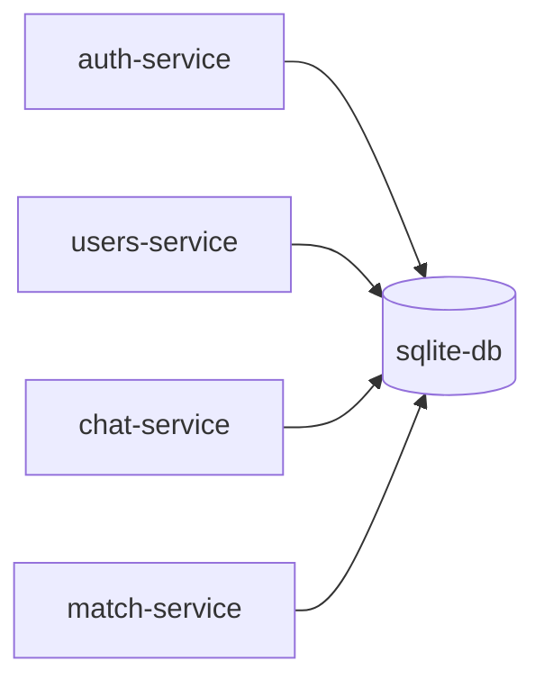

# sqlite-db

> **Image credit:** Pixabay — “Database, Storage, Data (Vector)”  
> Source page: https://pixabay.com/vectors/database-storage-data-cloud-4941301/

---

## What this service is

`sqlite-db` is the **vault** of the system.

In a ludic view:
- The microservices (auth/users/chat/...) are **authorized officers**
- `sqlite-db` is the **vault keeper** inside a **private intranet**
- It stores, protects, and retrieves every official record

This service is **not public** and must never be accessed directly by clients.

---

## Core responsibilities

- **Central persistence layer** for all user/system data
- **Creates and maintains the database schema** (tables + triggers)
- Handles **all INSERT / UPDATE / SELECT / DELETE** for the microservices
- Applies the system rules at the data layer (uniqueness, relations, etc.)

---

## Private network rule

Only internal services are allowed to talk to the vault.

# sqlite-db — Controllers (ludic + technical)

> **Ludic role:** `sqlite-db` is the **Vault Keeper** in a private intranet.  
> Authorized officers (microservices) knock on the vault door, and the keeper either **stores** records or **retrieves** them.

---

## Healthcheck

## Route: `hello` (testDatabaseConnection)

### 🎭 Story (ludic view)
The vault keeper opens a tiny window and says:
> “Yes, I’m alive and guarding the records.”

### ✅ What it does
Returns a simple success string.

### 📥 Inputs
- none

### 📤 Responses
- `200` → `"The sqlite-db is working perfectly"`

---

## Match / History

## Route: `addHistory`

### 🎭 Story
A match report arrives and the vault keeper files it into the **history archive**.

### ✅ What it does
Stores match stats via `databaseModels.addHistory(stats)`.

### 📥 Inputs (required)
- `stats` *(any)*

### 📤 Responses
- `201` → `"History added successfully"`
- `400` → `"INVALID_FORMAT"`
- `500` → `"An error happened"`

---

## Route: `getHistory`

### 🎭 Story
The vault keeper pulls the latest match records from the archive for a citizen.

### ✅ What it does
Returns history list for a user with a default limit.

### 📥 Inputs (required)
- `user_id` *(string)*
- `limit` *(number, optional — default 20)*

### 📤 Responses
- `200` → `history[]` or `[]`
- `400` → `"You need to inform your user_id here"`
- `500` → `"An error happened"`

---

## Flappy Bird (minigame)

## Route: `getFlappyHighScore`

### 🎭 Story
The vault keeper checks the citizen’s “Flappy record” page.

### ✅ What it does
Fetches the user high score.

### 📥 Inputs (required)
- `user_id` *(string)*

### 📤 Responses
- `200` → `{ high_score: number }` (defaults to `{ high_score: 0 }` when empty)
- `400` → `"You need to inform your user_id here"`
- `500` → `"An error happened"`

### ⚠️ Implementation note
The catch block logs `err` but receives `error` (typo). Harmless to runtime if not referenced elsewhere, but logs may break.

---

## Route: `setFlappyHighScore`

### 🎭 Story
A new best run is recorded and stamped into the vault.

### ✅ What it does
Updates the user high score.

### 📥 Inputs (required)
- `user_id` *(string)*
- `score` *(number)*

### 📤 Responses
- `200` → `"High score updated successfully"`
- `400` → `"You need to inform your user_id and high_score here"`
- `500` → `"An error happened"`

---

## Auth / Register / Login (vault-side)

## Route: `registerNewUser`

### 🎭 Story
A new citizen application arrives. The vault keeper:
1) checks required identity fields  
2) forges a password lock (hash)  
3) files both the **auth record** and the **user profile** (via model)

### ✅ What it does
Hashes password and registers user via `databaseModels.registerNewUser(...)`.

### 📥 Inputs (required)
- `username` *(string)*
- `nickname` *(string)*
- `password` *(string)*
- `email` *(string)*
- `is2faEnable` *(any/optional)*

### 📤 Responses
- `204` → *(No Content)*
- `400` → `"You need to fill all the fields"`
- `409` → `"USER_ALREADY_EXISTS"` (SQL constraint)
- `500` → `"INTERNAL_SERVER_ERROR"`

---

## Route: `tryLoginTheUser`

### 🎭 Story
A citizen presents email + password. The vault keeper:
- finds the stored lock
- compares keys (bcrypt compare)
- grants or denies passage

### ✅ What it does
Validates credentials directly against stored hash.

### 📥 Inputs (required)
- `email` *(string)*
- `password` *(string)*

### 📤 Responses
- `204` → *(No Content)*
- `400` → `"You need to fill all the fields"`
- `404` → `"The user does not exist"`
- `401` → `"User/Password incorrect"`
- `500` → `err.message`

---

## Route: `getUserData`

### 🎭 Story
Given an email, the vault keeper returns the citizen’s basic identity card:
> `{ username, user_id }`

### ✅ What it does
Fetches `username` and `user_id` by email.

### 📥 Inputs (required)
- `email` *(string)*  
  > Your code does `const email = req.body;` so it expects body to be the email value itself.

### 📤 Responses
- `200` → `{ username, user_id }`
- `400` → `"You need to give the email to make that request"`
- `404` → `"Not found the user"`
- `500` → `"Internal server error"`

---

## Route: `checkEmail`

### 🎭 Story
The vault keeper checks if a citizen exists with that email.

### ✅ What it does
Verifies whether a user exists for the given email.

### 📥 Inputs (required)
- `email` *(string)*

### 📤 Responses
- `200` → `"That is a valid e-mail"`
- `400` → `"You need to inform an e-mail"`
- `404` → `"There is not a user with that target email"`
- `500` → `"Internal Server Error"`

---

## Route: `newPassword`

### 🎭 Story
A citizen requests a new key. The vault keeper:
- rejects if it’s the same old key
- forges a new lock (hash)
- updates the record

### ✅ What it does
Prevents same-password reuse and updates the stored password hash.

### 📥 Inputs (required)
- `email` *(string)*
- `password` *(string)*

### 📤 Responses
- `200` → `"success"`
- `409` → `"You cannot put the same password as a new one"`
- `500` → `"Fatal error"`

---

## Route: `getAuthData`

### 🎭 Story
An officer requests the citizen’s “police file” by internal ID.

### ✅ What it does
Returns auth info for a `user_id`.

### 📥 Inputs (required)
- `user_id` *(string)*

### 📤 Responses
- `200` → `auth data` or `{}`
- `400` → `"You need to inform your user_id here"`
- `500` → `"An error happened"`

---

## Auth field updates

## Route: `setAuthUsername`
### 🎭 Story
The vault keeper updates the citizen’s official username.

### ✅ Inputs (required)
- `user_id` *(string)*
- `username` *(string)*

### 📤 Responses
- `200` → `"Success"`
- `400` → `"You need to inform your user_id and a new username here"`
- `500` → `"An error happened"`

---

## Route: `setAuthNickname`
### 🎭 Story
Updates the citizen’s nickname in the police file.

### ✅ Inputs (required)
- `user_id` *(string)*
- `nickname` *(string)*  
  > ⚠️ Your validation checks `req.body.username` (typo). The intent is nickname.

### 📤 Responses
- `200` → `"Success"`
- `400` → `"You need to inform your user_id and a new nickname here"`
- `500` → `"An error happened"`

---

## Route: `setAuthEmail`
### 🎭 Story
Updates the citizen’s email, rejecting duplicates.

### ✅ Inputs (required)
- `user_id` *(string)*
- `email` *(string)*

### 📤 Responses
- `200` → `"Success"`
- `400` → `"You need to inform your user_id and a new email here"`
- `409` → `"Email already in use"`
- `500` → `"An error happened"`

---

## Route: `setAuthPassword`
### 🎭 Story
The vault keeper issues a new key but refuses “same key again”.

### ✅ Inputs (required)
- `user_id` *(string)*
- `email` *(string)*
- `password` *(string)*

### 📤 Responses
- `200` → `"Success"`
- `400` → `"You cannot change your password to the same one"` OR missing fields message
- `404` → `"Invalid credentials"`
- `500` → `"An error happened"`

---

## Users profile (vault-side)

## Route: `createNewUser`
### 🎭 Story
The vault keeper opens a “profile body” folder for the citizen (users table).

### ✅ Inputs
- `user_id` *(string)*  
  > Your code destructures `{ username, user_id }` but only uses `user_id`.

### 📤 Responses
- `201` → `"Success"`
- `500` → `"Error creating the user"`

---

## Route: `validateUserEmail`
### 🎭 Story
The vault keeper stamps: “Email verified ✅”.

### ✅ Inputs (required)
- `email` *(string)*
- `stats` *(any — must not be undefined)*

### 📤 Responses
- `200` → `"Success"`
- `400` → `"You need to inform an email and put a valid status here"`
- `500` → `"An error happened trying to validate your e-mail"`

---

## Route: `getIsOnline`
### 🎭 Story
The vault keeper reads the “online lamp” for the citizen.

### ✅ Inputs (required)
- `email` *(string)*

### 📤 Responses
- `200` → `{ isOnline: ... }` or `{}`
- `400` → `"You need to inform an email here"`
- `500` → `"An error happened"`

---

## Route: `setIsOnline`
### 🎭 Story
The vault keeper flips the online lamp ON/OFF.

### ✅ Inputs (required)
- `user_id` *(string)*
- `isOnline` *(boolean/number)*

### 📤 Responses
- `200` → `"Success"`
- `400` → `"You need to inform an email here"` *(message mismatch: code checks user_id/isOnline)*
- `500` → `"An error happened"`

---

## Route: `getUserAvatar`
### 🎭 Story
The vault keeper fetches the citizen’s portrait.

### ✅ Inputs (required)
- `user_id` *(string)*
- `email` *(string)*

### 📤 Responses
- `200` → avatar payload or `{}`
- `400` → `"You need to inform an email and user_id here"`
- `500` → `"An error happened"`

---

## Route: `setUserAvatar`
### 🎭 Story
The citizen replaces the portrait photo.

### ✅ Inputs (required)
- `user_id` *(string)*
- `avatar` *(string)*

### 📤 Responses
- `201` → `"Success"`
- `400` → `"You need to inform an user_id and avatar here"`
- `500` → `"An error happened"`

---

## Route: `getUserInformation`
### 🎭 Story
The vault keeper opens the full profile folder and returns everything.

### ✅ Inputs (required)
- `user_id` *(string)*

### 📤 Responses
- `200` → profile data or `{}`
- `400` → `"You need to inform your user_id here"`
- `500` → `"An error happened"`

---

## Route: `setUserDescription`
### 🎭 Story
The citizen writes a bio; the vault keeper stores it.

### ✅ Inputs (required)
- `user_id` *(string)*
- `description` *(string | null; must not be undefined)*

### 📤 Responses
- `200` → `"Success"`
- `400` → `"You need to inform your user_id here"`
- `500` → `"An error happened"`

---

## Route: `setUserExperience` (setUserExperiencePoints)
### 🎭 Story
The vault keeper updates XP in the profile body.

### ✅ Inputs (required)
- `user_id` *(string)*
- `experience` *(number)*

### 📤 Responses
- `200` → `"Success"`
- `400` → `"You need to inform your user_id/experience here"`
- `500` → `"An error happened"`

---

## Route: `setUserFriends`
### 🎭 Story
The vault keeper updates the “friends count” number on the profile.

### ✅ Inputs (required)
- `user_id` *(string)*
- `friends` *(number)*

### 📤 Responses
- `200` → `"Success"`
- `400` → `"You need to inform your user_id/quantity of new friends here"`
- `500` → `"An error happened"`

---

## Route: `setUserWins`
### 🎭 Story
The vault keeper stamps a new win in the record.

### ✅ Inputs (required)
- `user_id` *(string)*
- `wins` *(number)*

### 📤 Responses
- `200` → `"Success"`
- `400` → `"You need to inform your user_id and new wins"`
- `500` → `"An error happened"`

---

## Route: `setUserLosses`
### 🎭 Story
The vault keeper stamps a new loss in the record.

### ✅ Inputs (required)
- `user_id` *(string)*
- `losses` *(number)*

### 📤 Responses
- `200` → `"Success"`
- `400` → `"You need to inform your user_id and new losses"`
- `500` → `"An error happened"`

---

## Route: `setUserTitle`
### 🎭 Story
The citizen earns a new “title badge”; the vault keeper updates it.

### ✅ Inputs (required)
- `user_id` *(string)*
- `title` *(string)*

### 📤 Responses
- `200` → `"Success"`
- `400` → `"You need to inform your user_id and a new title"`
- `500` → `"An error happened"`

---

## Ranking / State

## Route: `setUserState`
### 🎭 Story
The vault keeper updates the citizen’s visible status (ONLINE, OFFLINE, INGAME…).

### ✅ Inputs (required)
- `email` *(string)*
- `state` *(string)*

### 📤 Responses
- `200` → `"Success"`
- `400` → `"You need to inform an email and the state here"`
- `500` → `"An error happened"`

---

## Route: `setRank`
### 🎭 Story
The vault keeper updates the ladder rank.

### ✅ Inputs (required)
- `user_id` *(string)*
- `rank` *(number)*

### 📤 Responses
- `200` → `"Success"`
- `400` → `"You need to inform an email and the rank here"` *(message mismatch)*
- `500` → `"An error happened"`

---

## Route: `getRank`
### 🎭 Story
The vault keeper reads the current rank badge.

### ✅ Inputs (required)
- `user_id` *(string)*

### 📤 Responses
- `200` → rank payload or `{}`
- `400` → `"You need to inform an email here"` *(message mismatch)*
- `500` → `"An error happened"`

---

## 2FA (vault-side)

## Route: `get2FAEnable`
### 🎭 Story
The vault keeper checks if the second lock is switched ON.

### ✅ Inputs (required)
- `email` *(string)*

### 📤 Responses
- `200` → `{ twoFactorEnable: boolean }` or `{}`
- `400` → `"You need to inform an email here"`
- `500` → `"Internal server error"`

---

## Route: `get2FASecret`
### 🎭 Story
The keeper checks if a secret exists (if not, setup must create QR later).

### ✅ Inputs (required)
- `email` *(string)*

### 📤 Responses
- `200` → `{ twoFactorSecret: string | null }` or `{}`
- `400` → `"You need to inform an email here"`
- `500` → `"Internal server error"`

---

## Route: `set2FASecret`
### 🎭 Story
The vault keeper stores (or clears) the secret material for the second lock.

### ✅ Inputs (required)
- `email` *(string)*
- `secret` *(string | null)*

### 📤 Responses
- `200` → `"Secret set successfully"`
- `400` → `"You need to inform an email here"`
- `500` → `"An error happened"`

---

## Route: `get2FAValidate`
### 🎭 Story
The keeper tells whether the user already passed the 2FA checkpoint for the current login cycle.

### ✅ Inputs (required)
- `email` *(string)*

### 📤 Responses
- `200` → `{ twoFactorValidate: boolean }` or `null`
- `400` → `"You need to inform an email here"`
- `500` → `"Internal Server Error"`

---

## Route: `set2FAValidate`
### 🎭 Story
The vault keeper stamps the validation flag: passed ✅ / not passed ❌.

### ✅ Inputs (required)
- `email` *(string)*
- `signal` *(boolean)*

### 📤 Responses
- `200` → `"Signal updated successfully"`
- `400` → `"You need to inform an email here"`
- `500` → `"An error happened"`

---

## Route: `set2FAOnOff`
### 🎭 Story
The vault keeper flips the “2FA switch” for the citizen and returns the resulting state.

### ✅ Inputs (required)
- `user_id` *(string)*

### 📤 Responses
- `200` → `{ message: "2FA_ENABLED" | "2FA_DISABLED" | <other> }`
- `400` → `"You need to inform user_id here"`
- `500` → `"An error happened"`

---

## Matchmaking / Queue

## Route: `getQueue`
### 🎭 Story
The vault keeper opens the waiting-room clipboard and shows who is queued.

### ✅ Inputs
- none

### 📤 Responses
- `200` → queue payload or `{}`
- `500` → `"An error happened"`

---

## Route: `setInQueue`
### 🎭 Story
The citizen enters/leaves the waiting room; the vault keeper updates the flag.

### ✅ Inputs (required)
- `email` *(string)*
- `inQueue` *(boolean/number)*

### 📤 Responses
- `200` → `"Success"`
- `400` → `"You need to inform an email and the signal for inQueue here"`
- `500` → `"An error happened"`

---

## Route: `getMatchId`
### 🎭 Story
The vault keeper tells the citizen which match ticket (match_id) is assigned.

### ✅ Inputs (required)
- `email` *(string)*

### 📤 Responses
- `200` → `{ match_id: number }`
- `400` → `"You need to inform an email here"`
- `500` → `"An error happened"`

---

## Route: `setMatchId`
### 🎭 Story
The vault keeper writes the new match ticket number in the record.

### ✅ Inputs (required)
- `email` *(string)*
- `match_id` *(number)*

### 📤 Responses
- `200` → `"Success"`
- `400` → `"You need to inform an email and the match_id here"`
- `500` → `"An error happened"`

---

## Global listing

## Route: `getAllUsersInformation`
### 🎭 Story
The vault keeper opens the whole registry index and lists all citizens.

### ✅ Inputs
- none

### 📤 Responses
- `200` → list payload or `null`
- `500` → `"An error happened"`

---

## Route: `getDataByPublicId`
### 🎭 Story
Given a public badge (`public_id`), the keeper retrieves the matching profile data.

### ✅ Inputs (required)
- `public_id` *(string)*

### 📤 Responses
- `200` → profile payload or `null`
- `400` → `"You need to inform the public_id here"`
- `500` → `"An error happened"`

---

## Account deletion

## Route: `deleteUserAccount`
### 🎭 Story
The vault keeper permanently removes the citizen’s records (as requested by authorized service).

### ✅ Inputs (required)
- `user_id` *(string)*

### 📤 Responses
- `204` → *(No Content)*
- `400` → `"You need to inform the user_id here"`
- `500` → `"An error happened"`

---

## Chat (public)

## Route: `storeMessage`
### 🎭 Story
A public message arrives with a display name; the keeper resolves it to an internal ID and archives the message.

### ✅ What it does
- resolves `name` → `user_id`
- stores the message

### 📥 Inputs (required)
- `name` *(string)*
- `msg` *(string)*

### 📤 Responses
- `204` → *(No Content)*
- `400` → `"You need to inform the name and the message here"`
- `500` → `"An error happened"`

---

## Route: `getAllMessages`
### 🎭 Story
The keeper opens the public chat book and returns the log.

### ✅ Inputs (required)
- `username` *(string)*

### 📤 Responses
- `200` → messages payload or `null`
- `400` → `"You need to inform who you are here"`
- `500` → `"An error happened"`

---

## Social (block / friends)

## Route: `blockTheUser`
### 🎭 Story
A citizen asks the vault keeper: “Block this public profile from me.”

### ✅ Inputs (required)
- `user_id` *(string)* (owner)
- `public_id` *(string)* (target)

### 📤 Responses
- `201` → *(created a new block)*
- `204` → *(already blocked / no-op)*
- `403` → `"SAME_USER"`
- `400` → `"You need to inform user_id and public_id"`
- `500` → `"An error happened"`

---

## Route: `friendInvite`
### 🎭 Story
A citizen sends a friendship invite; the keeper records it (or auto-accepts if already mutual, depending on model logic).

### ✅ Inputs (required)
- `user_id` *(string)*
- `public_id` *(string)*

### 📤 Responses
- `201` → *(INVITED or ACCEPTED)*
- `200` → *(no-op / already exists)*
- `403` → `"SAME_USER"`
- `400` → `"You need to inform user_id and public_id"`
- `500` → `"An error happened"`

---

## Route: `getAllFriends`
### 🎭 Story
The keeper opens the citizen’s friends ledger.

### ✅ Inputs (required)
- `user_id` *(string)*

### 📤 Responses
- `200` → friends list or `null`
- `400` → `"You need to inform user_id"`
- `500` → `"An error happened"`

---

## Route: `getAllPendencies`
### 🎭 Story
The keeper checks pending friendship requests.

### ✅ Inputs (required)
- `user_id` *(string)*

### 📤 Responses
- `200` → pendencies list or `null`
- `400` → `"You need to inform user_id"`
- `500` → `"An error happened"`

---

## Route: `setAcceptFriend`
### 🎭 Story
The citizen answers an invite: accept ✅ / refuse ❌. The keeper writes the decision.

### ✅ Inputs (required)
- `user_id` *(string)*
- `public_id` *(string)*
- `accept` *(boolean)*

### 📤 Responses
- `204` → *(No Content)*
- `400` → `"You need to inform user_id"`
- `500` → `"An error happened"`

### ⚠️ Implementation note
Your validation uses `!req.body.accept`, which rejects `accept = false` (refuse). If you want to allow refusal, check `accept === undefined` instead.

---

## Route: `deleteAFriend`
### 🎭 Story
The keeper removes a friendship relation from the ledger.

### ✅ Inputs (required)
- `user_id` *(string)*
- `public_id` *(string)*

### 📤 Responses
- `true` *(your code returns true)*  
- `400` → `"You need to inform user_id"`
- `500` → `"An error happened"`

---

## Route: `getAllBlacklist`
### 🎭 Story
The keeper opens the “blocked users” registry.

### ✅ Inputs
- none

### 📤 Responses
- `200` → blacklist list or `null`
- `500` → `"An error happened"`

---

## Private chat (DMs)

## Route: `getAllPrivateMessages`
### 🎭 Story
The keeper opens the private conversation folder between:
- `user_id` (citizen)
- target identified by `public_id`

### ✅ Inputs (required)
- `user_id` *(string)*
- `public_id` *(string)*

### 📤 Responses
- `200` → messages list or `[]`
- `400` → `"You need to inform user_id and public_id here"`
- `500` → `"An error happened"`

---

## Route: `getPrivateInbox`
### 🎭 Story
The keeper opens the citizen’s DM mailbox index.

### ✅ Inputs (required)
- `user_id` *(string)*

### 📤 Responses
- `200` → inbox list or `[]`
- `400` → `"You need to inform user_id here"`
- `500` → `"An error happened"`

---

## Route: `storePrivateMessage`
### 🎭 Story
A DM letter is filed into the private archive.

### ✅ Inputs (required)
- `user_id` *(string)* (sender)
- `public_id` *(string)* (receiver public badge)

### 📤 Responses
- `201` → `"Created"`
- `400` → `"You need to inform user_id and public_id here"`
- `500` → `"An error happened"`

---

## Legacy / deprecated (chat target)

## Route: `setTargetId`
### 🎭 Story
Legacy: store a “current chat target” pointer.

### ✅ Inputs (required)
- `user_id` *(string)*
- `public_id` *(string)*

### 📤 Responses
- `201` → `{ message: "Success" }`
- `400` → `"You need to inform user_id / public_id here"`
- `500` → `"An error happened"`

---

## Route: `getTargetId`
### 🎭 Story
Legacy: retrieve the stored target pointer.

### ✅ Inputs (required)
- `public_id` *(string)*

### 📤 Responses
- `201` → target payload or `null`
- `400` → `"You need to inform public_id here"`
- `500` → `"An error happened"`

---

## Identity helper

## Route: `getPublicId`
### 🎭 Story
Given an internal ID, the keeper returns the public badge.

### ✅ Inputs (required)
- `user_id` *(string)*

### 📤 Responses
- `201` → `public_id` or `null`
- `400` → `"You need to inform user_id here"`
- `500` → `"An error happened"`
