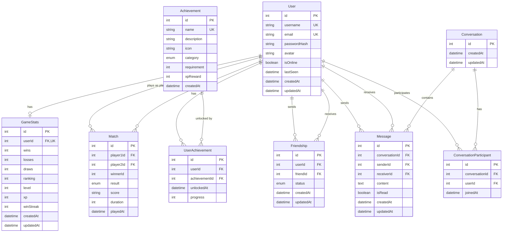

# Frontend Minor Module

## Minimal technical requirement
- Single Page Application (SPA)
- Compatible with Mozilla Firefox
- Writen in TypeScript
- Tailwind for CSS styling

## Tech stack
- React: to build interactive UI
- Next.js: to manage routes and optimize fonts and images
- Prisma/Postgres: ORM and database provider

## System requirements
- Node.js 20.9 or later installed.
- Operating system: Linux, Mac and Windows.
- pnpm 10.x

## Running the development server
Run `pnpm i` to install the project's packages.
```bash
pnpm i
```
Followed by `pnpm dev` to start the development server.
```bash
pnpm dev
```
Open http://localhost:3000 on your browser.

## Database Schema

