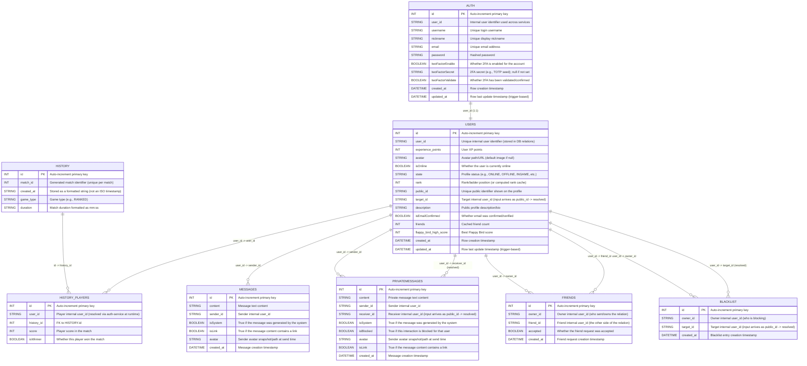

```mermaid
erDiagram
  AUTH {
    INT id PK "Auto-increment primary key"
    STRING user_id "Internal user identifier used across services"
    STRING username "Unique login username"
    STRING nickname "Unique display nickname"
    STRING email "Unique email address"
    STRING password "Hashed password"
    BOOLEAN twoFactorEnable "Whether 2FA is enabled for the account"
    STRING twoFactorSecret "2FA secret (e.g., TOTP seed); null if not set"
    BOOLEAN twoFactorValidate "Whether 2FA has been validated/confirmed"
    DATETIME created_at "Row creation timestamp"
    DATETIME updated_at "Row last update timestamp (trigger-based)"
  }

  USERS {
    INT id PK "Auto-increment primary key"
    STRING user_id "Unique internal user identifier (stored in DB relations)"
    INT experience_points "User XP points"
    STRING avatar "Avatar path/URL (default image if null)"
    BOOLEAN isOnline "Whether the user is currently online"
    STRING state "Profile status (e.g., ONLINE, OFFLINE, INGAME, etc.)"
    INT rank "Rank/ladder position (or computed rank cache)"
    STRING public_id "Unique public identifier shown on the profile"
    STRING target_id "Target internal user_id (input arrives as public_id -> resolved)"
    STRING description "Public profile description/bio"
    BOOLEAN isEmailConfirmed "Whether email was confirmed/verified"
    INT friends "Cached friend count"
    INT flappy_bird_high_score "Best Flappy Bird score"
    DATETIME created_at "Row creation timestamp"
    DATETIME updated_at "Row last update timestamp (trigger-based)"
  }

  HISTORY {
    INT id PK "Auto-increment primary key"
    INT match_id "Generated match identifier (unique per match)"
    STRING created_at "Stored as a formatted string (not an ISO timestamp)"
    STRING game_type "Game type (e.g., RANKED)"
    STRING duration "Match duration formatted as mm:ss"
  }

  HISTORY_PLAYERS {
    INT id PK "Auto-increment primary key"
    STRING user_id "Player internal user_id (resolved via auth-service at runtime)"
    INT history_id "FK to HISTORY.id"
    INT score "Player score in the match"
    BOOLEAN isWinner "Whether this player won the match"
  }

  MESSAGES {
    INT id PK "Auto-increment primary key"
    STRING content "Message text content"
    STRING sender_id "Sender internal user_id"
    BOOLEAN isSystem "True if the message was generated by the system"
    BOOLEAN isLink "True if the message content contains a link"
    STRING avatar "Sender avatar snapshot/path at send time"
    DATETIME created_at "Message creation timestamp"
  }

  PRIVATEMESSAGES {
    INT id PK "Auto-increment primary key"
    STRING content "Private message text content"
    STRING sender_id "Sender internal user_id"
    STRING receiver_id "Receiver internal user_id (input arrives as public_id -> resolved)"
    BOOLEAN isSystem "True if the message was generated by the system"
    BOOLEAN isBlocked "True if this interaction is blocked for that user"
    STRING avatar "Sender avatar snapshot/path at send time"
    BOOLEAN isLink "True if the message content contains a link"
    DATETIME created_at "Message creation timestamp"
  }

  FRIENDS {
    INT id PK "Auto-increment primary key"
    STRING owner_id "Owner internal user_id (who sent/owns the relation)"
    STRING friend_id "Friend internal user_id (the other side of the relation)"
    BOOLEAN accepted "Whether the friend request was accepted"
    DATETIME created_at "Friend request creation timestamp"
  }

  BLACKLIST {
    INT id PK "Auto-increment primary key"
    STRING owner_id "Owner internal user_id (who is blocking)"
    STRING target_id "Target internal user_id (input arrives as public_id -> resolved)"
    DATETIME created_at "Blacklist entry creation timestamp"
  }

  AUTH ||--|| USERS : "user_id (1:1)"

  HISTORY ||--o{ HISTORY_PLAYERS : "id -> history_id"
  USERS  ||--o{ HISTORY_PLAYERS : "user_id -> user_id"

  USERS ||--o{ MESSAGES : "user_id -> sender_id"

  USERS ||--o{ PRIVATEMESSAGES : "user_id -> sender_id"
  USERS ||--o{ PRIVATEMESSAGES : "user_id -> receiver_id (resolved)"

  USERS ||--o{ FRIENDS : "user_id -> owner_id"
  USERS ||--o{ FRIENDS : "user_id -> friend_id"

  USERS ||--o{ BLACKLIST : "user_id -> owner_id"
  USERS ||--o{ BLACKLIST : "user_id -> target_id (resolved)"

%% Runtime notes:
%% - receiver/target arrive as public_id from the client; backend resolves USERS(public_id)->USERS(user_id).
%% - For match history, services may ask auth-service to obtain user_id before inserting HISTORY_PLAYERS rows.
%% - HISTORY is independent: it represents the match entity; players are attached via HISTORY_PLAYERS.

```
