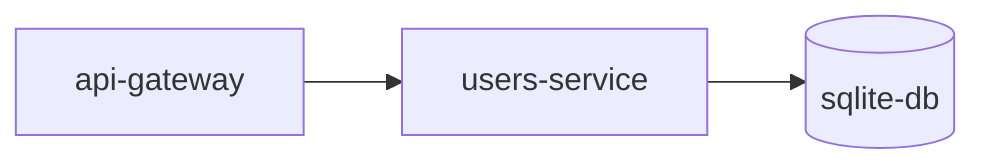

# users-service


> **Image credit:** Pixabay — “User, Little Man, Icon” (Vector).  
> Source page: https://pixabay.com/vectors/user-little-man-icon-social-media-3331256/

---

## What this service is

`users-service` is responsible for **user profile data** and everything that represents the “public body” of the user inside the system.

In a ludic view:

- The **api-gateway** is the **messenger** who brings requests from the outside world.
- The **users-service** is the **Citizen Registry Office**:
  - it stores and updates profile data
  - it keeps the public identity (`public_id`) and the internal identity (`user_id`)
  - it holds progression info like XP, rank, avatar, etc.
- The **sqlite-db** is the **archive room** inside a private intranet.


## Route: `createNewUser`

### 🎭 Story (ludic view)
A new citizen has just been approved by the inspector (auth flow), and now the **Citizen Registry Office** (users-service) must create the **user body/profile**.

This route is the clerk saying:
> “Ok, I will open a new profile folder for this user.”

### ✅ What it does
Creates a new user profile record (delegates to `usersModel.createNewUser`).

### 📥 Inputs (required)
Request body:
- `email` *(string)*


### 📤 Responses
- `201` → `"New user account created"`
- `400` → `"You need to inform email"`
- `500` → `"Error creating user account"`
## Route: `getFlappyHighScore`

### 🎭 Story (ludic view)
The registry clerk opens the **minigame record** and answers:
> “What is your best Flappy Bird score so far?”

### ✅ What it does
Fetches the user’s Flappy Bird high score from sqlite-db.

### 📥 Inputs (required)
Request body:
- `user_id` *(string)*

### 📤 Responses
- `200` → `highScore.data` or `{}`
- `400` → `"You need to inform user id here"`
- `500` → `"Internal Server Error"`

### 🔒 Internal call (intranet)
- `POST https://sqlite-db:3002/getFlappyHighScore` with `req.body`
## Route: `setFlappyHighScore`

### 🎭 Story (ludic view)
The user finishes a Flappy Bird run and the clerk stamps the new score:
> “I will record your score in your profile.”

### ✅ What it does
Stores/updates the user’s Flappy Bird high score.

### 📥 Inputs (required)
Request body:
- `user_id` *(string)*
- `score` *(number)*

### 📤 Responses
- `200` → `"Success"`
- `500` → `"An error happened"`

### 🔒 Internal call (intranet)
- `POST https://sqlite-db:3002/setFlappyHighScore` with `req.body`
## Route: `addHistory`

### 🎭 Story (ludic view)
A match ends, and the clerk receives the match stats:
> “I will attach this match record to the archive.”

### ✅ What it does
Adds match history data by forwarding it to sqlite-db.

### 📥 Inputs (required)
Request body:
- `stats` *(any)* — must exist (your code checks only presence)

### 📤 Responses
- `200` → `"Success"`
- `500` → `"An error happened"`

### 🔒 Internal call (intranet)
- `POST https://sqlite-db:3002/addHistory` with `req.body`
## Route: `getHistory`

### 🎭 Story (ludic view)
The user asks the clerk:
> “Show me my match history.”

### ✅ What it does
Fetches the user’s match history from sqlite-db.

### 📥 Inputs (required)
Request body:
- `user_id` *(string)*

### 📤 Responses
- `200` → `history.data` or `{}`
- `400` → `"You need to inform user id here"`
- `500` → `"Internal Server Error"`

### 🔒 Internal call (intranet)
- `POST https://sqlite-db:3002/getHistory` with `req.body`
## Route: `setUserExperience`

### 🎭 Story (ludic view)
The clerk updates the citizen’s progress:
> “You gained XP. I will update your experience points.”

### ✅ What it does
Sets/updates a user’s experience points in sqlite-db.

### 📥 Inputs (required)
Request body:
- `user_id` *(string)*
- `experience` *(number)*

### 📤 Responses
- `200` → `"Success"`
- `500` → `"An error happened"`

### 🔒 Internal call (intranet)
- `POST https://sqlite-db:3002/setUserExperience` with `req.body`
## Route: `validateUserEmail`

### 🎭 Story (ludic view)
The inspector confirms the email, then the registry clerk marks the citizen as:
> “Email verified ✅”

### ✅ What it does
Marks a user email as validated by forwarding the action to sqlite-db.

### 📥 Inputs (required)
Request body must include:
- `email` *(string)*
- `user_id` *(string)*
- `stats` *(any)* 

### 📤 Responses
- `200` → `"Success"`
- `400` → `"YOU_NEED_TO_FILL_ALL"`
- `500` → `"Internal Server Error"`

### 🔒 Internal call (intranet)
- `POST https://sqlite-db:3002/validateUserEmail` with `req.body`

## Route: `getIsOnline`

### 🎭 Story (ludic view)
Someone asks the registry:
> “Is this citizen online right now?”

### ✅ What it does
Fetches the online status using the user’s email.

### 📥 Inputs (required)
Request body:
- `email` *(string)*

### 📤 Responses
- `200` → `isOnline` 
- `400` → `"You need to inform an email here"`
- `500` → `"Internal Server Error"`

### 🔒 Internal call (intranet)
- `POST https://sqlite-db:3002/getIsOnline` with `req.body`


## Route: `setUserState`

### 🎭 Story (ludic view)
The clerk updates the citizen’s visible status:
> “OFFLINE, ONLINE, INGAME… I will update the state.”

### ✅ What it does
Sets the user `state` by email.

### 📥 Inputs (required)
Request body:
- `email` *(string)*
- `state` *(string)*

### 📤 Responses
- `200` → `"Success"`
- `400` → `"You need to inform an email and the state"`
- `500` → `"An error happened"`

### 🔒 Internal call (intranet)
- `POST https://sqlite-db:3002/setUserState` with `req.body`

## Route: `setRank`

### 🎭 Story (ludic view)
The clerk updates the citizen’s rank badge:
> “Your ladder rank changed. I will update your rank.”

### ✅ What it does
Sets the user rank in sqlite-db.

### 📥 Inputs (required)
Request body:
- `user_id` *(string)*
- `rank` *(number)* — must not be `undefined`

### 📤 Responses
- `200` → `"Success"`
- `400` → `"You need to inform an email and the rank"` *(message says email but code requires user_id)*
- `500` → `"An error happened"`

### 🔒 Internal call (intranet)
- `POST https://sqlite-db:3002/setRank` with `req.body`
## Route: `getRank`

### 🎭 Story (ludic view)
The citizen asks:
> “What is my current rank?”

### ✅ What it does
Fetches user rank from sqlite-db.

### 📥 Inputs (required)
Request body:
- `user_id` *(string)*

### 📤 Responses
- `200` → `rank.data` or `{}`
- `400` → `"You need to inform an email here"` *(message says email but code requires user_id)*
- `500` → `"Internal Server Error"`

### 🔒 Internal call (intranet)
- `POST https://sqlite-db:3002/getRank` with `req.body`
## Route: `setIsOnline`

### 🎭 Story (ludic view)
The clerk flips the citizen’s “online light”:
> “Online ✅ / Offline ❌”

### ✅ What it does
Sets `isOnline` flag in sqlite-db with strict parameter validation.

### 📥 Inputs (required)
Request body:
- `user_id` *(string)*
- `isOnline` *(boolean | number)* — code allows only boolean or number

### 📤 Responses
- `200` → `"Success"`
- `400` → `"INVALID_PARAMETERS"`
- `500` → `"An error happened"`

### 🔒 Internal call (intranet)
- `POST https://sqlite-db:3002/setIsOnline` with `req.body`
## Route: `getUserAvatar`

### 🎭 Story (ludic view)
The clerk opens the profile folder and retrieves the portrait:
> “Here is the avatar of this user.”

### ✅ What it does
Fetches the user avatar from sqlite-db.

### 📥 Inputs (required)
Request body:
- `user_id` *(string)*
- `email` *(string)*

### 📤 Responses
- `200` → `avatar.data` or `null`
- `400` → `"You need to inform an email here"`
- `500` → `"An error happened"`

### 🔒 Internal call (intranet)
```js
axios.post("https://sqlite-db:3002/getUserAvatar", {
  user_id,
  email,
});
```

## Route: `setUserAvatar`

### 🎭 Story (ludic view)
The citizen brings a new portrait photo.
The clerk updates the profile folder:
> “Avatar updated.”

### ✅ What it does
Sets the user avatar in sqlite-db.

### 📥 Inputs (required)
Request body:
- `user_id` *(string)*
- `avatar` *(string)* — path/URL

### 📤 Responses
- `201` → `"Avatar updated successfully"`
- `400` → `"You need to inform an user_id and an avatar here"`
- `500` → `"Error setting an avatar"`

### 🔒 Internal call (intranet)
```js
axios.post("https://sqlite-db:3002/setUserAvatar", { user_id, avatar })
```

## Route: `getUserInformation`

### 🎭 Story (ludic view)
The clerk opens the citizen’s full profile folder:
> “Here is the complete user information.”

### ✅ What it does
Fetches user information by `user_id`.

### 📥 Inputs (required)
Request body:
- `user_id` *(string)*

### 📤 Responses
- `200` → `response.data` or `null`
- `400` → `"You need to inform an user_id here"`
- `500` → `"An error happened"`

### 🔒 Internal call (intranet)
```js
axios.post("https://sqlite-db:3002/getUserInformation", { user_id })
```

## Route: `setUserDescription`

### 🎭 Story (ludic view)
The citizen writes a short bio for the profile.
The clerk updates the “description” field.

### ✅ What it does
Sets the user profile description.

### 📥 Inputs (required)
Request body:
- `user_id` *(string)*
- `description` *(string | null)* — must not be `undefined`

### 📤 Responses
- `200` → `response.data` or `null`
- `400` → `"You need to inform an user_id and a description here"`
- `500` → `err.response.data` or `"An error happened"`

### 🔒 Internal call (intranet)
- `POST https://sqlite-db:3002/setUserDescription` with `req.body`
## Route: `getAllUsersInformation`

### 🎭 Story (ludic view)
The clerk opens the entire registry index:
> “List all citizens and their public info.”

### ✅ What it does
Fetches all users information (global list).

### 📥 Inputs
- None

### 📤 Responses
- `200` → `response.data` or `null`
- `500` → `"An error happened"`

### 🔒 Internal call (intranet)
- `GET https://sqlite-db:3002/getAllUsersInformation`
## Route: `getDataByPublicId`

### 🎭 Story (ludic view)
Someone only knows the public badge (`public_id`) and asks:
> “Show me the profile data for this public ID.”

### ✅ What it does
Fetches user data by `public_id`.

### 📥 Inputs (required)
Request body:
- `public_id` *(string)*

### 📤 Responses
- `200` → `response.data` or `null`
- `400` → `"You need to inform the public_id"`
- `500` → `"An error happened"`

### 🔒 Internal call (intranet)
- `POST https://sqlite-db:3002/getDataByPublicId` with `req.body`
## Route: `blockTheUser`

### 🎭 Story (ludic view)
A citizen requests:
> “I want to block this person from contacting/appearing to me.”

The clerk validates:
- you cannot block yourself
- target must be identified by `public_id`

### ✅ What it does
Creates a block record by forwarding to sqlite-db.

### 📥 Inputs (required)
Request body:
- `user_id` *(string)* — blocker (owner)
- `public_id` *(string)* — target public profile id

### 📤 Responses
- `204` *(or status forwarded from sqlite)* → empty body
- `400` → `"You need to inform the user_id and public_id"`
- `403` → `"SAME_USER"`
- `500` → empty body

### 🔒 Internal call (intranet)
- `POST https://sqlite-db:3002/blockTheUser` with `req.body`

## Route: `friendInvite`

### 🎭 Story (ludic view)
A citizen sends a friendship request:
> “Invite this person to be my friend.”

The clerk ensures:
- you cannot invite yourself

### ✅ What it does
Creates a friend invite by forwarding to sqlite-db.

### 📥 Inputs (required)
Request body:
- `user_id` *(string)* — inviter
- `public_id` *(string)* — invited user (public)

### 📤 Responses
- `204` *(or forwarded status)* → empty body
- `400` → `"You need to inform the user_id and public_id"`
- `403` → `"SAME_USER"`
- `500` → empty body

### 🔒 Internal call (intranet)
- `POST https://sqlite-db:3002/friendInvite` with `req.body`
## Route: `getAllFriends`

### 🎭 Story (ludic view)
The citizen asks:
> “Show me my friends list.”

### ✅ What it does
Fetches all friends for a given `user_id`.

### 📥 Inputs (required)
Request body:
- `user_id` *(string)*

### 📤 Responses
- `200` → `response.data` or `null`
- `400` → `"You need to inform the user_id"`
- `500` → `"An error happened"`

### 🔒 Internal call (intranet)
- `POST https://sqlite-db:3002/getAllFriends` with `req.body`
## Route: `getAllPendencies`

### 🎭 Story (ludic view)
The citizen asks:
> “Do I have pending friend requests?”

### ✅ What it does
Fetches all pending friendship requests / pendencies for a user.

### 📥 Inputs (required)
Request body:
- `user_id` *(string)*

### 📤 Responses
- `200` → `response.data` or `null`
- `400` → `"You need to inform the user_id"`
- `500` → `"An error happened"`

### 🔒 Internal call (intranet)
- `POST https://sqlite-db:3002/getAllPendencies` with `req.body`
## Route: `setAcceptFriend`

### 🎭 Story (ludic view)
A citizen replies to an invite:
> “I accept ✅” or “I refuse ❌”.

The clerk records the decision.

### ✅ What it does
Sets the acceptance flag for a friendship invite.

### 📥 Inputs (required)
Request body must include:
- `user_id` *(string)*
- `public_id` *(string)*
- `accept` *(boolean)*

### 📤 Responses
- `204` → *(No Content)*
- `400` → `"You need to inform user_id, acceptFlag and public_id"`
- `500` → `"An error happened"`

### 🔒 Internal call (intranet)
- `POST https://sqlite-db:3002/setAcceptFriend` with `req.body`
## Route: `deleteAFriend`

### 🎭 Story (ludic view)
A citizen requests:
> “Remove this person from my friends list.”

The clerk deletes the relationship.

### ✅ What it does
Deletes a friendship relation.

### 📥 Inputs (required)
Request body:
- `user_id` *(string)*
- `public_id` *(string)*

### 📤 Responses
- `204` → *(No Content)*
- `400` → `"You need to inform user_id, acceptFlag and public_id"`
- `500` → `"An error happened"`

### 🔒 Internal call (intranet)
- `POST https://sqlite-db:3002/deleteAFriend` with `req.body`
## Route: `getAllBlacklist`

### 🎭 Story (ludic view)
The clerk opens the “blocked citizens” registry:
> “Show all blacklist entries.”

### ✅ What it does
Fetches all blacklist records.

### 📥 Inputs
- None

### 📤 Responses
- `200` → `blacklist.data` or `null`
- `500` → `"An error happened"`

### 🔒 Internal call (intranet)
- `GET https://sqlite-db:3002/getAllBlacklist`
## Route: `getPublicId`

### 🎭 Story (ludic view)
The citizen asks:
> “Given my official internal ID (`user_id`), what is my public badge (`public_id`)?”

### ✅ What it does
Fetches `public_id` for a given `user_id`.

### 📥 Inputs (required)
Request body:
- `user_id` *(string)*

### 📤 Responses
- `200` → `response.data` or `null`
- `400` → `"You need to inform user_id here"`
- `500` → `"An error happened"`

### 🔒 Internal call (intranet)
- `POST https://sqlite-db:3002/getPublicId` with `req.body`
